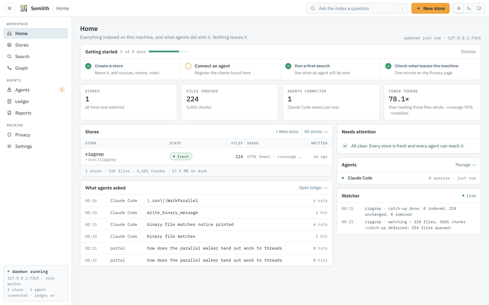
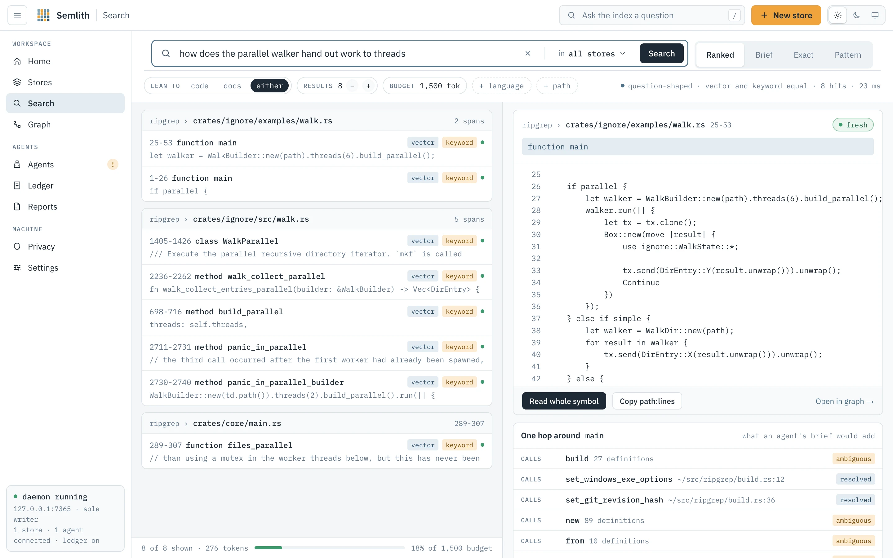
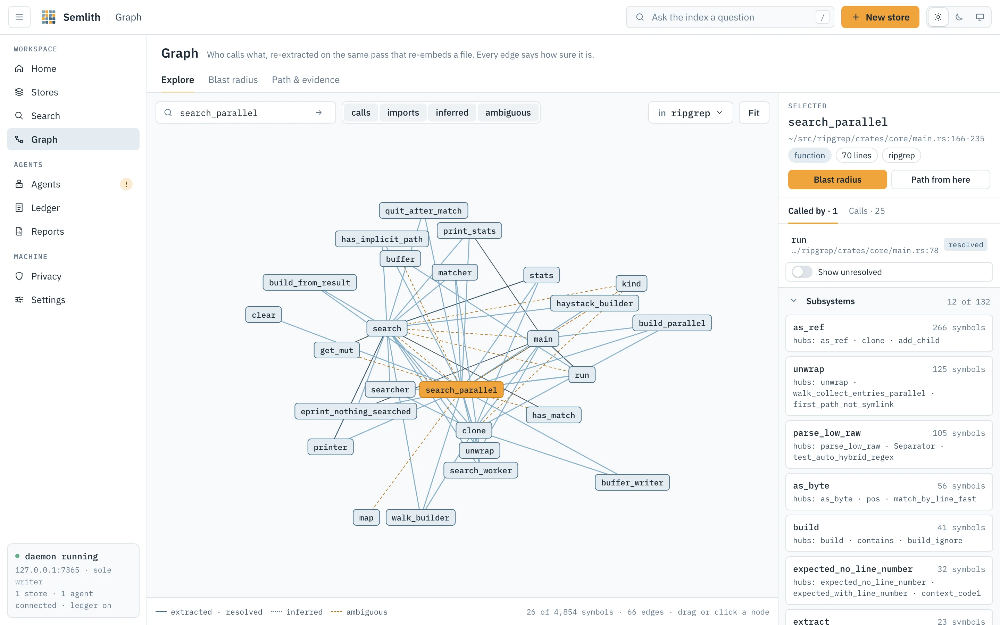
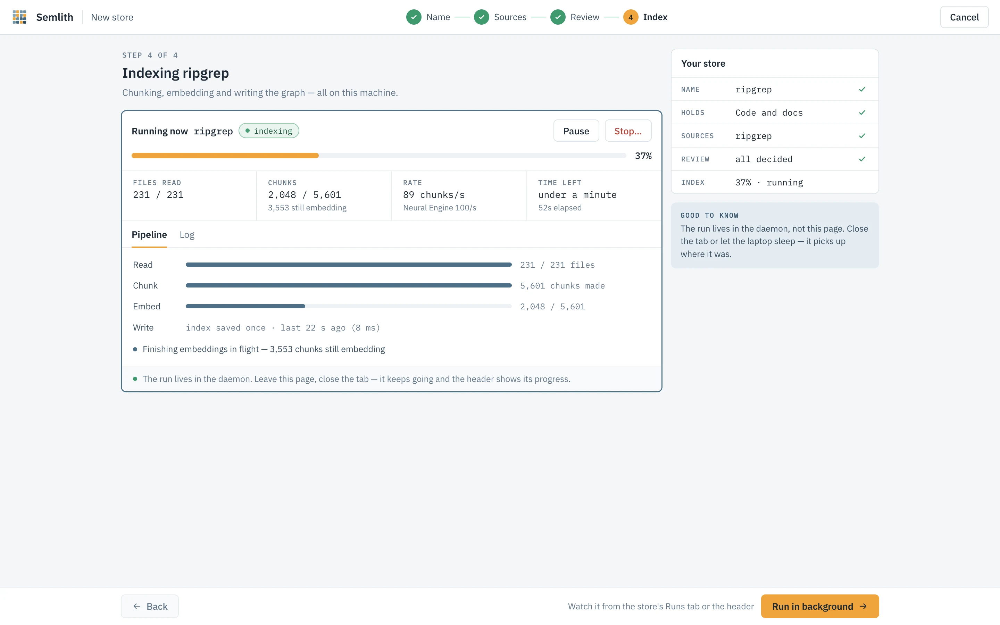
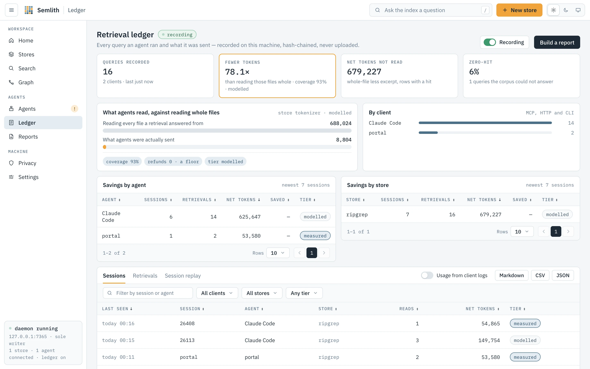

<div align="center">


# Semlith

**A local vector store and code graph for AI agents.** Index your code and
documents once, keep the index current as you save, and answer an agent's
questions in milliseconds — without anything leaving the machine.

[](https://github.com/semlith/semlith/actions/workflows/ci.yml)
[](https://crates.io/crates/semlith)
[](https://crates.io/crates/semlith)
[](https://docs.rs/semlith)
[](https://www.rust-lang.org)
[](#install)
[](https://modelcontextprotocol.io)
[](LICENSE)

[Install](#install) · [Quick start](#quick-start) · [Agents](#use-it-from-an-agent) ·
[Portal](#the-portal) · [Benchmarks](#benchmarks) · [Docs](#documentation)

</div>

<picture>
  <source media="(prefers-color-scheme: dark)" srcset="docs/images/home-dark.webp">
  
</picture>

## Why Semlith

An agent working in a large codebase either reads too much, which is slow and
expensive, or guesses which file to open, which is often wrong. What it needs is
the few spans that answer the question. Semlith finds them.

- **Hybrid search.** Every query runs against a vector index (meaning) and a
  keyword index (exact names), and the two rankings are fused. *How does retry
  backoff work* and `EMBED_BATCH` both land on the right chunk.
- **A code graph built on the same pass.** Definitions become nodes; calls,
  imports and re-exports become edges, each labelled with how well it is
  supported. Ask what calls a function, what breaks if it changes, or how two
  symbols connect.
- **Always current.** A watcher re-embeds a file when you save it. There is no
  build step and nothing to go stale against your working tree.
- **Local by design.** No API keys, no network at query time, a portal bound to
  `127.0.0.1` only. Model weights are the one download, pinned by digest.
- **Made for agents.** An MCP server with sixteen tools, registered in your
  agent clients by one command, and a ledger of every retrieval with the tokens
  it saved.
- **More than code.** PDFs, Office documents, notebooks and Markdown are read
  as text; images are searchable by what they show.

## Install

One command, no Rust toolchain needed.

<!-- install-oneliners:start -->
**macOS and Linux**

```sh
curl --proto '=https' --tlsv1.2 -fsSL https://raw.githubusercontent.com/semlith/semlith/main/install.sh | sh
```

**Windows**

```powershell
irm https://raw.githubusercontent.com/semlith/semlith/main/install.ps1 | iex
```
<!-- install-oneliners:end -->

The installer picks the release for your machine, checks it against the
release's `SHA256SUMS`, unpacks it into `~/.semlith/bin` and runs `semlith
setup`. Setup puts semlith on your `PATH`, downloads the embedding model,
registers semlith with the agent clients it finds, and installs the daemon as a
login service. Run `semlith setup` again at any time to repair an install;
`--yes` takes every default.

| Variable | Effect |
|---|---|
| `SEMLITH_VERSION` | Install a specific release tag. |
| `SEMLITH_HOME` | Install somewhere other than `~/.semlith`. |
| `SEMLITH_NO_SERVICE=1` | Skip the login service. |

Other routes: `cargo install semlith`, or an archive from
[the releases page](https://github.com/semlith/semlith/releases).
`semlith upgrade` replaces the binary with the newest release; semlith never
checks for updates on its own.

**Requirements.** A 64-bit machine running macOS on Apple silicon, Linux on
x86_64 or aarch64, or Windows on x86_64 (Windows PowerShell 5.1 is enough).
The Linux archives ship `libonnxruntime.so` beside the binary and need only
glibc **2.34** or later and libstdc++ (GLIBCXX_3.4.22): Debian 12, Ubuntu 22.04,
RHEL 9 and Amazon Linux 2023 all qualify. Intel macOS is not supported, because
ONNX Runtime no longer ships for it.

### Verifying the installer

The installer writes the binary to `~/.semlith/bin` (mode 700 on macOS and
Linux) and, on Linux, `libonnxruntime.so` beside it. Nothing is written until
the archive passes two checks: its SHA-256 against `SHA256SUMS`, and — when
`gh` is on your `PATH` — its GitHub artifact attestation, signed by this
repository's release workflow. Without `gh` it says provenance was not
verified. curl is held to https and TLS 1.2+, and the script runs only once it
has fully downloaded. Releases before v0.36.0 carry no attestations.

To read the installer before running it:

```sh
curl --proto '=https' --tlsv1.2 -fsSLO https://github.com/semlith/semlith/releases/latest/download/install.sh
less install.sh
gh attestation verify install.sh --repo semlith/semlith
sh install.sh
```

On Windows: `irm https://github.com/semlith/semlith/releases/latest/download/install.ps1 -OutFile install.ps1`,
read it, then `powershell -ExecutionPolicy Bypass -File install.ps1`.

To verify an archive by hand:

```sh
grep "  semlith-<tag>-<target>.tar.gz$" SHA256SUMS | shasum -a 256 -c
gh attestation verify semlith-<tag>-<target>.tar.gz --repo semlith/semlith
```

## Quick start

```sh
cd ~/src/ripgrep
semlith index .                                   # one store; the model (~52 MB) downloads once
semlith search "where is a file detected as binary"
semlith neighbors search_parallel                 # callers and callees
semlith start                                     # the daemon and the portal
```

```console
$ semlith search "where is a file detected as binary" -k 1
1. 0.083 vf  GUIDE.md:735-746
   binary files:

   1. The default mode is to attempt to remove binary files from a search
      completely. ...

$ semlith neighbors search_parallel
callers (2)
  main via defines (extracted)  crates/core/main.rs:44  · call at line 166
  run via calls (resolved)  crates/core/main.rs:78  · call at line 90
callees (25)
  matcher via calls (resolved)  crates/core/flags/hiargs.rs:379  · called at crates/core/main.rs:177
  search_worker via calls (resolved)  crates/core/flags/hiargs.rs:705  · called at crates/core/main.rs:176
  ...
```

Every hit is a `path:start-end` locator you can hand to an editor or an agent;
`vf` says the vector and keyword lists both found it.

## Use it from an agent

```sh
semlith setup     # registers semlith in every agent client it finds
semlith doctor    # checks each client can actually reach it, and says how to fix it if not
```

`setup` registers the MCP server at user scope in every client with a
registration command — 12 clients are documented and launched in CI,
[docs/clients.md](docs/clients.md) has every stanza and the HTTP transport. It
also installs the semlith Agent Skill, a steering hook that suggests the
semlith call when an agent is about to grep, and a read-only research agent.

`semlith mcp` serves MCP over stdio; the daemon serves the same tools over HTTP
at `/mcp`, behind an agent key (`semlith key show`). Eight tools are listed by
default, because every definition costs tokens on every request;
`SEMLITH_MCP_TOOLS=all` lists all sixteen.

| Tool | Answers |
|---|---|
| `semlith_search` | Where is the answer? Path, span, enclosing symbol and how it was found. |
| `semlith_brief` | Everything one question needs in one call — spans, text, one-hop callers and callees — under a token budget. |
| `semlith_read` | One span or one symbol, nothing around it. |
| `semlith_symbol` | Where is this defined? `history: true` gives what it used to be. |
| `semlith_neighbors` | What calls it, and what it calls. |
| `semlith_impact` | Everything that reaches it, and the files involved. |
| `semlith_files` | Which files are indexed. |
| `semlith_stats` | What each store holds. |
| `semlith_path`, `semlith_trace` | How two symbols connect, as a chain or as evidence. |
| `semlith_pattern` | A tree-sitter structural pattern over one language. |
| `semlith_index`, `semlith_add`, `semlith_forget` | Change a store from inside a conversation. |
| `semlith_report` | One of five reports from the ledger, index and graph. |
| `semlith_languages` | The language names `lang` accepts. |

A bare `semlith mcp` opens every registered store, so one question can span
repositories. Supported MCP versions: `2026-07-28`, `2025-11-25`, `2025-06-18`
and `2024-11-05`, each proven by a session in `tests/mcp.rs`.

## The portal

`semlith start` runs one daemon that owns every store: it holds each store's
write lock, watches its folders, re-embeds what you save, and serves a portal at
`http://127.0.0.1:7365`. The URL with its session token is printed once, on
stdout. [docs/portal.md](docs/portal.md) documents every page.

<table>
<tr>
<td width="50%"><picture><source media="(prefers-color-scheme: dark)" srcset="docs/images/search-dark.webp"></picture><br><b>Search</b> — hybrid results, each saying which list found it.</td>
<td width="50%"><picture><source media="(prefers-color-scheme: dark)" srcset="docs/images/graph-dark.webp"></picture><br><b>Graph</b> — callers, callees, blast radius and paths.</td>
</tr>
<tr>
<td><picture><source media="(prefers-color-scheme: dark)" srcset="docs/images/indexing-dark.webp"></picture><br><b>Index runs</b> — live rate per device, pause and stop.</td>
<td><picture><source media="(prefers-color-scheme: dark)" srcset="docs/images/ledger-dark.webp"></picture><br><b>Ledger</b> — every retrieval, and the tokens it saved.</td>
</tr>
</table>

**It is not on the network.** The daemon binds `127.0.0.1` only, with no flag
to change it. Every page and `/api/` route needs the per-run session token,
sent in a `Semlith-Token` request header; without it the answer is 401. The
agent key opens `/mcp` and nothing else. Responses carry a
`Content-Security-Policy` of `'self'`, no CORS header is sent, and every byte
the portal loads is compiled into the binary. `--airgap` refuses every download
that is not already cached. The Privacy page checks these claims against the
running daemon; [docs/security.md](docs/security.md) is the full account.

## How it works

```
files ──chunk──> text ──embed──> vectors ──quantize──> index/*.tvim  (turbovec)
                  │
                  └──parse──> symbols, edges ─────────> store.db      (SQLite)

query ──embed──> vector ──search shards──┐
      ──keywords──> FTS5 ────────────────┴──fuse──> ranked spans ──> enclosing symbol
```

- **Reading.** Files are read as the text a person would see. Thirteen formats
  have their own reader (PDF, Word, PowerPoint, Excel, notebooks and more);
  everything else is UTF-8, cut into line-aligned chunks of up to 800
  characters. A Markdown chunk is embedded with its heading path, a code chunk
  with its enclosing definition.
- **Embedding.** `granite-embedding-small-english-r2` (int8, 384 dimensions,
  ~52 MB) through ONNX Runtime, fixed per store. The daemon also embeds on the
  Neural Engine on Apple silicon and on the GPU (Core ML, WebGPU or CUDA), each
  lane checked against known answers before its first batch. Images go through
  CLIP ViT-B/32 into a second vector space; matching is by what an image shows,
  not OCR.
- **Storing.** `index/` holds [turbovec](https://github.com/RyanCodrai/turbovec)
  shards of 65 536 quantized vectors; `store.db` holds chunk text, spans,
  symbols, edges, the ledger and the content hashes that make re-indexing
  incremental. A save rewrites one shard.
- **Graph.** All 46 languages carry edges. Each edge is `extracted` (settled by
  the file itself), `resolved` (one candidate), `ambiguous` (several, and it
  says how many) or `inferred` (a bare name match). `semlith path` refuses to
  cross a name it cannot pin down unless you pass `--all-edges`.

[docs/architecture.md](docs/architecture.md) is the full account.

## Commands

| Command | Does |
|---|---|
| `semlith index [PATHS...]` | Index paths into a store; re-running embeds only what changed. `--each` gives each path its own store, `--projects <DIR>` one per repository. |
| `semlith watch [PATHS...]` | Re-embed files as they are saved. |
| `semlith start` | The daemon: every store kept current, the portal and `/mcp` on `127.0.0.1:7365`. |
| `semlith search <QUERY>` | Hybrid search. `-k`, `--json`, `--path`/`--ext`/`--lang` (repeatable; a leading `!` excludes), `--prefer code\|docs`, `--exact` for regex lines with their definition. |
| `semlith brief <QUESTION>` | Spans, their text and one-hop callers and callees, under `--budget` tokens (default 4000). |
| `semlith read <TARGET>` | One span (`src/store.rs:1041-1080`) or one symbol. |
| `semlith symbol`, `neighbors`, `impact`, `path`, `trace` | The graph: definitions, callers and callees, blast radius, chains, evidence. |
| `semlith pattern <QUERY> --lang L` | A tree-sitter structural pattern. |
| `semlith stats`, `files`, `languages`, `models` | What a store holds; `files --tree` shows what was not indexed and why. |
| `semlith refused`, `scan` | Files not indexed and why; files held that today's rules would refuse. |
| `semlith add <URL>` | Fetch one https URL into a store. No crawling, no credentials, no private addresses. |
| `semlith forget`, `compact`, `drop` | Remove a file, reclaim dead bytes without re-embedding, delete a store. |
| `semlith adopt`, `trust` | Move a store into the store home; allow one outside it. |
| `semlith ledger`, `report`, `schedule`, `prices` | Retrieval history, five reports in five formats, scheduled reports, the price table. |
| `semlith mcp`, `hook`, `key` | MCP over stdio, the steering hook, the HTTP agent key. |
| `semlith setup`, `doctor`, `upgrade` | Install and repair, diagnose each client, replace the binary. |
| `semlith accel` | Which devices embed: CPU (always on, `SEMLITH_CPU_CAP` caps it), Neural Engine, GPU, and the experimental CUDA, TensorRT, OpenVINO and llama.cpp lanes. |
| `semlith cloud` | Semlith Cloud. Nothing here touches the network until `semlith cloud login`. |

`semlith <command> --help` documents every flag.

**Where stores live.** `~/.semlith/stores/<name>`, listed in
`~/.semlith/registry.json`, so `semlith mcp` and `semlith start` find every store
with no flags. A command picks its store from `--store` / `SEMLITH_STORE`, then a
`.semlith` beside the corpus, then the registered store covering the current
directory, and otherwise creates one.

**What gets indexed.** Everything under the given paths except `.gitignore`d
and hidden files, binaries, files over 8 MiB, archives that expand past 32 MiB,
and generated or vendored directories (`node_modules` always; `target`, `build`,
`dist`, `vendor` beside their manifest — `SEMLITH_DEFAULT_IGNORES=0` keeps
them). Credentials are never indexed; the grey zone is yours to decide.

## The retrieval ledger

Every retrieval — from an agent over MCP, the CLI or the portal — is recorded
in its store: the query, the client, the session, the hits and what was read.
Each row carries the hash of the row before it, so `semlith ledger --verify`
finds an edited or deleted row. It is local, on by default, and off with
`--no-ledger` or `SEMLITH_LEDGER=0`.

**What it saved on this repository.** Ask `semlith brief` all 107 questions of
this repository's retrieval harness against a store of `src/`, then run
`semlith ledger --verify`: **3 982 tokens** per answered question were sent to
the agent, against **105 132** for reading the 4.1 files those answers named,
whole — 26× less, at 100 % coverage, counted with the store's own tokenizer.
It is an upper bound: a file named by two answers is counted twice.

## Benchmarks

Public code-retrieval benchmarks, run by [`bench/scorecard/`](bench/scorecard/README.md)
on one M1 MacBook Air (4P+4E, 8 GB) in October 2026, indexing on its Neural
Engine. SWE-bench and the competitor table ran on the 0.38.0 build; CodeRAG-Bench,
RepoBench-R and the agent round ran on 0.36.0, whose search path is the same for
these image-free corpora. Each figure is the median of the runs named, with the
spread when it is not zero, and each table ends with the command that
reproduces it. Results are published as measured, including where another tool
wins.

The baselines are what an agent does without semlith. *BM25* ranks the files one
ripgrep pass hits; *grep then read* reads up to twenty of them whole, in that
order. "Tokens" are bytes returned divided by four, up to the first gold file.

<!-- scorecard:begin -->
### SWE-bench, retrieval only

The issue is the query; the gold is every file the reference patch edits; each instance is indexed at its own base commit.

| set | arm | instances | file hit@1 | @5 | @10 | all gold @10 | first gold within 4k tokens | median tokens to first gold |
|---|---|---|---|---|---|---|---|---|
| Lite | grep then read | 300 | 18.7 % | 37.3 % | 47.3 % | 47.3 % | 22.3 % | 8813 |
| Lite | semlith | 300 | 35.7 % | 59.0 % | 72.3 % | 72.3 % | 69.3 % | 225 |
| Verified | grep then read | 500 | 16.8 % | 37.6 % | 47.0 % | 42.2 % | 20.4 % | 15491 |
| Verified | semlith | 500 | 36.6 % | 64.8 % | 76.8 % | 70.4 % | 77.4 % | 224 |

`uv run --with pyarrow python bench/scorecard/swe.py walk && uv run --with pyarrow python bench/scorecard/swe.py score <run dir>...`

### CodeRAG-Bench, retrieval

Each task's canonical corpus and gold documents.

| task | queries | NDCG@10 BM25 | NDCG@10 semlith | Recall@10 BM25 | Recall@10 semlith |
|---|---|---|---|---|---|
| ds1000 | 513 | 0.158 | 0.260 | 0.246 | 0.379 |
| humaneval | 164 | 0.993 | 0.995 | 1.000 | 1.000 |
| mbpp | 500 | 0.973 | 0.999 | 1.000 | 1.000 |
| odex | 201 | 0.081 | 0.191 | 0.149 | 0.292 |
| repoeval | 373 | 0.735 | 0.683 | 0.496 | 0.485 |

`uv run --with pyarrow python bench/scorecard/coderag.py run --out ~/semlith-bench/scorecard/results/coderag/full`

### RepoBench-R

The query is the last `keep` lines of the in-file code; the candidates are the instance's own cross-file snippets. A seeded sample of 500 instances per configuration and level (seed 20261003) of the 48 000-instance test split.

| setting | level | keep | instances | acc@1 BM25 | acc@1 semlith | acc@5 BM25 | acc@5 semlith |
|---|---|---|---|---|---|---|---|
| java first | easy | 3 | 500 | 16.2 % | 16.8 % | 81.6 % | 83.4 % |
| java first | easy | 10 | 500 | 13.4 % | 12.2 % | 80.4 % | 82.8 % |
| java first | hard | 3 | 500 | 10.2 % | 11.2 % | 43.2 % | 51.0 % |
| java first | hard | 10 | 500 | 8.6 % | 7.6 % | 38.0 % | 44.6 % |
| java random | easy | 3 | 500 | 26.0 % | 28.0 % | 82.8 % | 87.4 % |
| java random | easy | 10 | 500 | 22.6 % | 23.0 % | 84.2 % | 86.4 % |
| java random | hard | 3 | 500 | 20.0 % | 19.2 % | 57.0 % | 63.8 % |
| java random | hard | 10 | 500 | 16.2 % | 17.2 % | 59.2 % | 58.8 % |
| python first | easy | 3 | 500 | 21.6 % | 25.2 % | 80.2 % | 85.0 % |
| python first | easy | 10 | 500 | 19.0 % | 25.0 % | 79.8 % | 84.0 % |
| python first | hard | 3 | 500 | 13.0 % | 18.0 % | 49.0 % | 49.6 % |
| python first | hard | 10 | 500 | 12.6 % | 16.4 % | 44.6 % | 51.8 % |
| python random | easy | 3 | 500 | 26.4 % | 29.8 % | 85.8 % | 87.8 % |
| python random | easy | 10 | 500 | 27.0 % | 26.2 % | 85.6 % | 84.8 % |
| python random | hard | 3 | 500 | 21.2 % | 28.6 % | 57.8 % | 62.4 % |
| python random | hard | 10 | 500 | 21.0 % | 22.8 % | 60.0 % | 60.0 % |

`uv run --with pyarrow python bench/scorecard/repobench.py run --out ~/semlith-bench/scorecard/results/repobench/full`

### Competitors, SWE-bench Lite

The same base-commit checkouts and issue text for every tool, on a seeded random sample of SWE-bench Lite; semlith beside each tool on exactly the instances that tool completed (all runs without an error). A tool whose cumulative indexing passed 4x semlith's is stopped and its remaining instances are "not run".

| tool | version | completed | file hit@1 | @5 | @10 | first gold within 4k tokens | semlith hit@5, same instances | semlith within 4k, same instances | not run |
|---|---|---|---|---|---|---|---|---|---|
| rg | 15.2.0 | 20/20 | 0.0 % | 15.0 % | 15.0 % | 15.0 % | 55.0 % | 60.0 % | — |
| ugrep | 7.8.5 | 20/20 | 0.0 % | 15.0 % | 15.0 % | 15.0 % | 55.0 % | 60.0 % | — |
| semble | 0.6.1 | 20/20 | 35.0 % | 50.0 % | 70.0 % | 70.0 % | 55.0 % | 60.0 % | — |
| graphify | 0.9.74 | 20/20 | 20.0 % | 35.0 % | 50.0 % | 65.0 % | 55.0 % | 60.0 % | — |
| serena | 1.7.0 | 16/20 | 18.8 % | 25.0 % | 25.0 % | 37.5 % | 56.2 % | 62.5 % | 4: search: TimeoutError |
| sourcebot | 5.1.15 | 20/20 | 20.0 % | 35.0 % | 35.0 % | 30.0 % | 55.0 % | 60.0 % | — |
| grepai | 0.37.0 | 0/20 | — | — | — | — | — | — | 19: not run: index budget; 1: index: TimeoutError |
| colgrep | 1.7.0 | 0/20 | — | — | — | — | — | — | 19: not run: index budget; 1: index: TimeoutExpired |
| ck | 0.7.11 | 0/20 | — | — | — | — | — | — | 19: not run: index budget; 1: index: TimeoutExpired |
| semlith, every instance |  | 20 | 30.0 % | 55.0 % | 60.0 % | 60.0 % |  |  |  |

`cd bench/scorecard && python3.11 competitors_swe.py walk && python3.11 competitors_swe.py score` (the slow tools in their own `--out` with `SEMLITH_VECTOR_CACHE_MB=0`, scored with `--also`; see bench/scorecard/README.md)

### Agents on an unfamiliar codebase

Headless Claude Code on 50 held-out questions generated from the code of a 70-repository corpus (not a public set: Opus has memorised SWE-bench Lite, `bench/scorecard/agent/contamination.md`).

| model | arm | runs | questions | correct | cost / session | cost / correct answer | median input tokens | sessions calling semlith |
|---|---|---|---|---|---|---|---|---|
| opus | grep (Grep, Glob, Read) | 3 | 50 | 92.0 % ±2.0 % | $0.068 ±$0.007 | $0.072 ±$0.008 | 17910 ±339 | 0 |
| opus | semlith installed, Grep built in | 3 | 50 | 92.0 % ±2.0 % | $0.061 ±$0.005 | $0.065 ±$0.005 | 22541 ±1197 | 0 ±1 |
| opus | semlith installed, Grep gated to semlith first | 3 | 50 | 96.0 % ±2.0 % | $0.076 ±$0.006 | $0.080 ±$0.008 | 30790 ±2159 | 45 ±6 |
| haiku | grep (Grep, Glob, Read) | 2 | 50 | 86.0 % ±4.0 % | $0.081 ±$0.003 | $0.099 ±$0.008 | 60523 ±3316 | 0 |
| haiku | semlith installed, Grep built in | 2 | 50 | 90.0 % ±2.0 % | $0.076 ±$0.003 | $0.086 ±$0.005 | 97593 ±15590 | 47 |
| haiku | semlith installed, Grep gated to semlith first | 2 | 50 | 88.0 % ±2.0 % | $0.082 ±$0.018 | $0.095 ±$0.022 | 94681 ±4755 | 42 ±2 |

`python3 bench/scorecard/agent/corpus_round.py`

### Savings in real sessions

The owner's own ledger across 8 stores, benchmark stores excluded: 1,575 retrievals, 87 % credited (measured/modelled). The excerpts returned were 1,281,313 tokens; the whole files they came from, 96,399,209 — 75.2x across all stores, 50.7x for the median store. That comparison is an upper bound on what reading would have cost, not a measurement of it; the agent table is the head-to-head.

`python3 bench/scorecard/ledger_savings.py`
<!-- scorecard:end -->

## The numbers

**Coverage**, read out of the code; `tests/readme.rs` fails the build if any of
these drifts from its source:

| | |
|---|---|
| languages searchable and graphed | **46** |
| edge kinds | **6** |
| document formats with a reader | **13** |
| image types | **5** |
| MCP tools | **16** |
| CLI commands | **36** |
| agent clients, each launched and answered in `tests/clients.rs` | **12** |
| prebuilt targets | **4** |

**Measured** on a 4P+4E Apple silicon laptop, with the command that reproduces
each; [docs/performance.md](docs/performance.md) has the full tables:

| | | |
|---|---|---|
| warm search at 700 / 7 000 / 70 000 chunks, peak RSS under 240 MB | **16.2 / 37.9 / 159.1 ms** | `cargo test --release --test measure -- --ignored --nocapture` |
| edit on disk to searchable | **under 5 s** | the same |
| indexing on an M1 Air: Neural Engine / CPU and GPU through Core ML | **229.8 / 62.7 chunks/s** p10 | [docs/performance.md](docs/performance.md) |
| daemon memory 60 s after a run, seven stores open | **465 MB** | `footprint -p <pid>` |
| idle watcher CPU over 60 s | **under 1.0 s** | the same |
| one changed file | **1 shard rewritten** | `cargo test --release --test shards -- --ignored --nocapture` |
| `tools/list` | **2 633 bytes**, eight tools; 1 323 tokens added to an Opus request | `cargo test --release --test retrieval -- --ignored` |
| retrieval, 30 sealed questions of 107 | **hit@1 24/30, hit@3 27/30, hit@8 29/30**, zero spread; identifiers **11 of 11** in the top three | the same |
| one search, rescoring off / on | **8.2 ms** / 132.2 ms on a 300-file store | the same |
| one answered question, `brief` against search-then-read | **1.00 calls vs 2.54**, 1 112 tokens vs 725 | the same |
| call-edge resolution | **62 %** settled | the same |
| the macOS arm64 binary | **125 435 312 bytes** (119.6 MiB) | `ls -l target/release/semlith` |
| the Linux glibc floor | **GLIBC_2.34** | `objdump -T semlith runtime/libonnxruntime.so` |

Peak memory does not grow with the corpus — plan for about 600 MB whatever you
index. Query latency does: the vector scan is linear.

## Known limits

- One writer per store. While the daemon or `semlith watch` holds a store, a
  second `semlith index` against it exits and names the holder.
- First indexing is bound by the model: about 230 chunks/s on an M1's Neural
  Engine, 63 on its CPU and GPU, 30 on the CPU alone. Later runs embed only what
  changed. On macOS the CPU lane alone runs at about 60 % of a terminal's speed
  inside the login service, because of how launchd schedules agent threads.
- On a Mac the GPU does not embed beside the Neural Engine unless you run
  `semlith accel on gpu-beside-ane`. CUDA runs on Linux x86_64 only; an NVIDIA
  card on Windows embeds through WebGPU.
- A new binary on macOS asks again for access to folders such as Documents, and
  a store there waits, showing `running`, until the prompt is answered.
- A store larger than `SEMLITH_INDEX_MEMORY` reads shards from disk on every
  query; raise the budget if the store fits in memory.
- The default model is English-only and fixed when a store is created. Image
  search is not OCR.
- Search filters are SQLite `GLOB` (no regex); `--lang` maps extensions and
  never reads contents. Multi-store search merges rankings rather than ranking
  jointly. Cross-encoder rescoring (`SEMLITH_RERANK=on`) is off by default: it
  costs about 16× the search time for two more answers in 77 at k=1.
- No code signing, no ARM64 Windows or Intel macOS build, and `semlith upgrade`
  only replaces a binary in `~/.semlith/bin`.

## Documentation

| Document | Covers |
|---|---|
| [docs/portal.md](docs/portal.md) | Every page and control of the portal. |
| [docs/clients.md](docs/clients.md) | Setup stanzas for 12 agent clients and the HTTP transport. |
| [docs/architecture.md](docs/architecture.md) | How the pieces fit together, and why. |
| [docs/performance.md](docs/performance.md) | Every measured number, with its command and date. |
| [docs/models.md](docs/models.md) | The embedding models, and how to choose one. |
| [docs/security.md](docs/security.md) | The threat model and what is on the wire. |
| [docs/compatibility.md](docs/compatibility.md) | What is a contract, and what a 0.x version promises. |
| [CHANGELOG.md](CHANGELOG.md) | What changed in each release. |

## Contributing

Contributions are welcome. [CONTRIBUTING.md](CONTRIBUTING.md) covers building,
the checks CI runs and what is out of scope; [AGENTS.md](AGENTS.md) is the same
for a coding agent. Everyone follows the [Code of Conduct](CODE_OF_CONDUCT.md).
To report a security problem, see [SECURITY.md](SECURITY.md) rather than opening
an issue.

## Prior art

Semlith's vector index is [turbovec](https://github.com/RyanCodrai/turbovec) by
Ryan Codrai (MIT), an implementation of TurboQuant from ["TurboQuant: Online
Vector Quantization with Near-optimal Distortion
Rate"](https://arxiv.org/abs/2504.19874) by Amir Zandieh, Majid Daliri, Majid
Hadian and Vahab Mirrokni. TurboQuant is data-oblivious: it rotates each vector
randomly and quantizes each coordinate on its own, with no training pass. That
is what an index refreshed on every file save needs — nothing to gather before
the first file, nothing to rebuild as the corpus grows, and a vector added is a
vector searchable.

## License

Apache-2.0. See [LICENSE](LICENSE) and [NOTICE](NOTICE).

Model weights are downloaded at runtime under their own licenses: the default,
ibm-granite/granite-embedding-small-english-r2, is Apache-2.0; the CLIP
ViT-B/32 pair, the WebGPU plugin (MIT) and the NVIDIA libraries the CUDA pack
fetches carry theirs. See [docs/models.md](docs/models.md).
