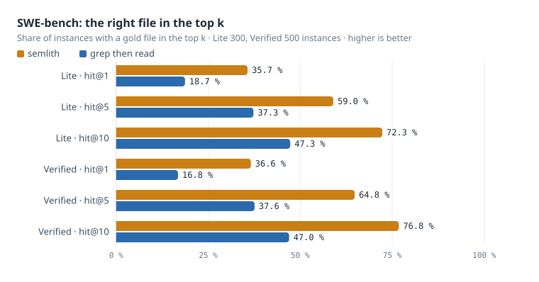
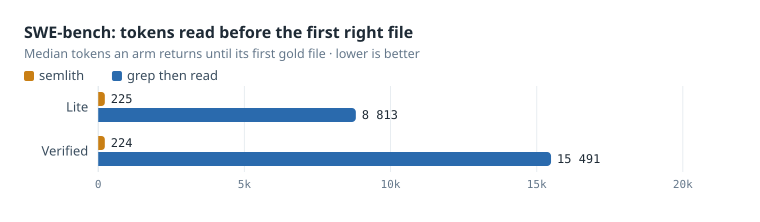
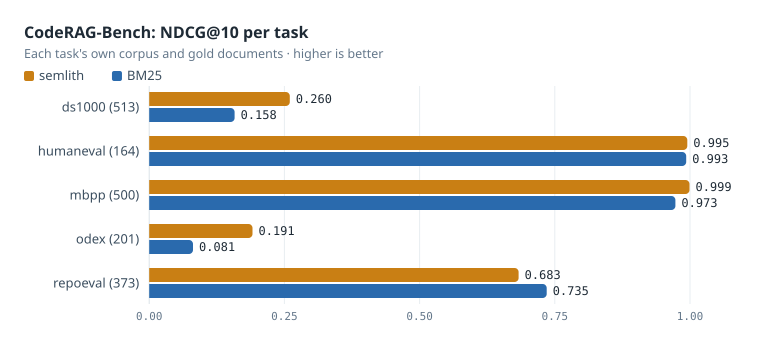
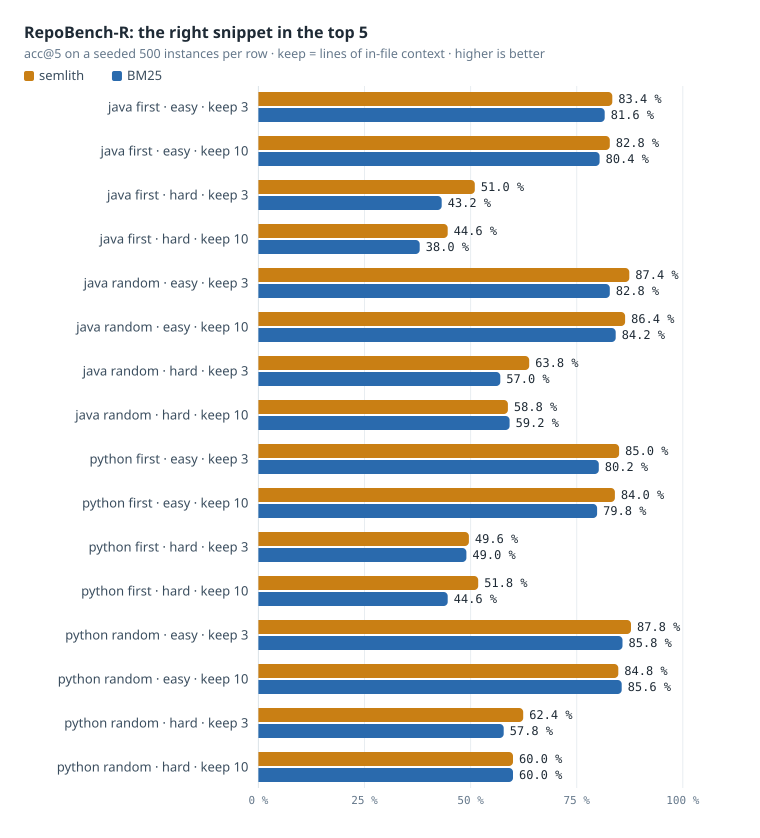
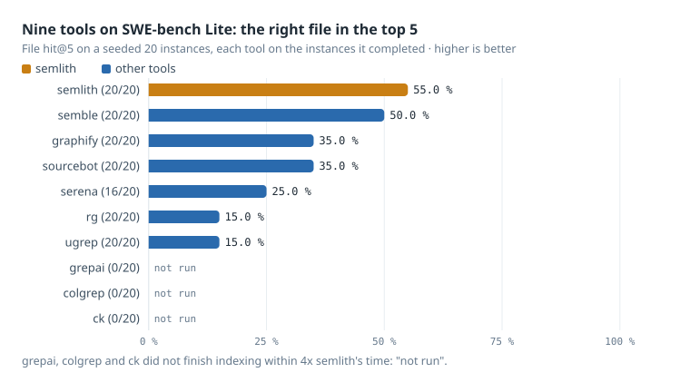
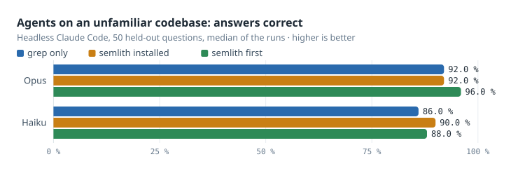
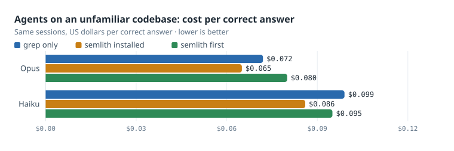

# The scorecard

Semlith on public code-retrieval benchmarks, against grep, BM25 and nine other
tools, with the harness that produced every number. The repository README shows
the headline charts; this page has every chart, every table and the command
behind each one.

## Results

Run on one M1 MacBook Air (4P+4E, 8 GB) in October 2026, indexing on its Neural
Engine. SWE-bench and the competitor table ran on the 0.38.0 build; CodeRAG-Bench,
RepoBench-R and the agent round ran on 0.36.0, whose search path is the same for
these image-free corpora. Each figure is the median of the runs named, with the
spread when it is not zero. Results are published as measured, including where
another tool wins.

The baselines are what an agent does without semlith. *BM25* ranks the files one
ripgrep pass hits; *grep then read* reads up to twenty of them whole, in that
order. "Tokens" are bytes returned divided by four, up to the first gold file.

### Charts

Drawn from the tables below by `python3 bench/scorecard/charts.py`, so a chart never disagrees with its table.

<picture><source media="(prefers-color-scheme: dark)" srcset="../../docs/images/bench/swe-hit-dark.svg"></picture>

<picture><source media="(prefers-color-scheme: dark)" srcset="../../docs/images/bench/swe-tokens-dark.svg"></picture>

<picture><source media="(prefers-color-scheme: dark)" srcset="../../docs/images/bench/coderag-dark.svg"></picture>

<picture><source media="(prefers-color-scheme: dark)" srcset="../../docs/images/bench/repobench-dark.svg"></picture>

<picture><source media="(prefers-color-scheme: dark)" srcset="../../docs/images/bench/competitors-dark.svg"></picture>

<picture><source media="(prefers-color-scheme: dark)" srcset="../../docs/images/bench/agents-correct-dark.svg"></picture>

<picture><source media="(prefers-color-scheme: dark)" srcset="../../docs/images/bench/agents-cost-dark.svg"></picture>

### Tables

Written by `python3 bench/scorecard/report.py --readme bench/scorecard/README.md` from the runs' own score files.

<!-- scorecard:begin -->
### SWE-bench, retrieval only

The issue is the query; the gold is every file the reference patch edits; each instance is indexed at its own base commit.

| set | arm | instances | file hit@1 | @5 | @10 | all gold @10 | first gold within 4k tokens | median tokens to first gold |
|---|---|---|---|---|---|---|---|---|
| Lite | grep then read | 300 | 18.7 % | 37.3 % | 47.3 % | 47.3 % | 22.3 % | 8813 |
| Lite | semlith | 300 | 35.7 % | 59.0 % | 72.3 % | 72.3 % | 69.3 % | 225 |
| Verified | grep then read | 500 | 16.8 % | 37.6 % | 47.0 % | 42.2 % | 20.4 % | 15491 |
| Verified | semlith | 500 | 36.6 % | 64.8 % | 76.8 % | 70.4 % | 77.4 % | 224 |

`uv run --with pyarrow python bench/scorecard/swe.py walk && uv run --with pyarrow python bench/scorecard/swe.py score <run dir>...`

### CodeRAG-Bench, retrieval

Each task's canonical corpus and gold documents.

| task | queries | NDCG@10 BM25 | NDCG@10 semlith | Recall@10 BM25 | Recall@10 semlith |
|---|---|---|---|---|---|
| ds1000 | 513 | 0.158 | 0.260 | 0.246 | 0.379 |
| humaneval | 164 | 0.993 | 0.995 | 1.000 | 1.000 |
| mbpp | 500 | 0.973 | 0.999 | 1.000 | 1.000 |
| odex | 201 | 0.081 | 0.191 | 0.149 | 0.292 |
| repoeval | 373 | 0.735 | 0.683 | 0.496 | 0.485 |

`uv run --with pyarrow python bench/scorecard/coderag.py run --out ~/semlith-bench/scorecard/results/coderag/full`

### RepoBench-R

The query is the last `keep` lines of the in-file code; the candidates are the instance's own cross-file snippets. A seeded sample of 500 instances per configuration and level (seed 20261003) of the 48 000-instance test split.

| setting | level | keep | instances | acc@1 BM25 | acc@1 semlith | acc@5 BM25 | acc@5 semlith |
|---|---|---|---|---|---|---|---|
| java first | easy | 3 | 500 | 16.2 % | 16.8 % | 81.6 % | 83.4 % |
| java first | easy | 10 | 500 | 13.4 % | 12.2 % | 80.4 % | 82.8 % |
| java first | hard | 3 | 500 | 10.2 % | 11.2 % | 43.2 % | 51.0 % |
| java first | hard | 10 | 500 | 8.6 % | 7.6 % | 38.0 % | 44.6 % |
| java random | easy | 3 | 500 | 26.0 % | 28.0 % | 82.8 % | 87.4 % |
| java random | easy | 10 | 500 | 22.6 % | 23.0 % | 84.2 % | 86.4 % |
| java random | hard | 3 | 500 | 20.0 % | 19.2 % | 57.0 % | 63.8 % |
| java random | hard | 10 | 500 | 16.2 % | 17.2 % | 59.2 % | 58.8 % |
| python first | easy | 3 | 500 | 21.6 % | 25.2 % | 80.2 % | 85.0 % |
| python first | easy | 10 | 500 | 19.0 % | 25.0 % | 79.8 % | 84.0 % |
| python first | hard | 3 | 500 | 13.0 % | 18.0 % | 49.0 % | 49.6 % |
| python first | hard | 10 | 500 | 12.6 % | 16.4 % | 44.6 % | 51.8 % |
| python random | easy | 3 | 500 | 26.4 % | 29.8 % | 85.8 % | 87.8 % |
| python random | easy | 10 | 500 | 27.0 % | 26.2 % | 85.6 % | 84.8 % |
| python random | hard | 3 | 500 | 21.2 % | 28.6 % | 57.8 % | 62.4 % |
| python random | hard | 10 | 500 | 21.0 % | 22.8 % | 60.0 % | 60.0 % |

`uv run --with pyarrow python bench/scorecard/repobench.py run --out ~/semlith-bench/scorecard/results/repobench/full`

### Competitors, SWE-bench Lite

The same base-commit checkouts and issue text for every tool, on a seeded random sample of SWE-bench Lite; semlith beside each tool on exactly the instances that tool completed (all runs without an error). A tool whose cumulative indexing passed 4x semlith's is stopped and its remaining instances are "not run".

| tool | version | completed | file hit@1 | @5 | @10 | first gold within 4k tokens | semlith hit@5, same instances | semlith within 4k, same instances | not run |
|---|---|---|---|---|---|---|---|---|---|
| rg | 15.2.0 | 20/20 | 0.0 % | 15.0 % | 15.0 % | 15.0 % | 55.0 % | 60.0 % | — |
| ugrep | 7.8.5 | 20/20 | 0.0 % | 15.0 % | 15.0 % | 15.0 % | 55.0 % | 60.0 % | — |
| semble | 0.6.1 | 20/20 | 35.0 % | 50.0 % | 70.0 % | 70.0 % | 55.0 % | 60.0 % | — |
| graphify | 0.9.74 | 20/20 | 20.0 % | 35.0 % | 50.0 % | 65.0 % | 55.0 % | 60.0 % | — |
| serena | 1.7.0 | 16/20 | 18.8 % | 25.0 % | 25.0 % | 37.5 % | 56.2 % | 62.5 % | 4: search: TimeoutError |
| sourcebot | 5.1.15 | 20/20 | 20.0 % | 35.0 % | 35.0 % | 30.0 % | 55.0 % | 60.0 % | — |
| grepai | 0.37.0 | 0/20 | — | — | — | — | — | — | 19: not run: index budget; 1: index: TimeoutError |
| colgrep | 1.7.0 | 0/20 | — | — | — | — | — | — | 19: not run: index budget; 1: index: TimeoutExpired |
| ck | 0.7.11 | 0/20 | — | — | — | — | — | — | 19: not run: index budget; 1: index: TimeoutExpired |
| semlith, every instance |  | 20 | 30.0 % | 55.0 % | 60.0 % | 60.0 % |  |  |  |

`cd bench/scorecard && python3.11 competitors_swe.py walk && python3.11 competitors_swe.py score` (the slow tools in their own `--out` with `SEMLITH_VECTOR_CACHE_MB=0`, scored with `--also`; see bench/scorecard/README.md)

### Agents on an unfamiliar codebase

Headless Claude Code on 50 held-out questions generated from the code of a 70-repository corpus (not a public set: Opus has memorised SWE-bench Lite, `bench/scorecard/agent/contamination.md`).

| model | arm | runs | questions | correct | cost / session | cost / correct answer | median input tokens | sessions calling semlith |
|---|---|---|---|---|---|---|---|---|
| opus | grep (Grep, Glob, Read) | 3 | 50 | 92.0 % ±2.0 % | $0.068 ±$0.007 | $0.072 ±$0.008 | 17910 ±339 | 0 |
| opus | semlith installed, Grep built in | 3 | 50 | 92.0 % ±2.0 % | $0.061 ±$0.005 | $0.065 ±$0.005 | 22541 ±1197 | 0 ±1 |
| opus | semlith installed, Grep gated to semlith first | 3 | 50 | 96.0 % ±2.0 % | $0.076 ±$0.006 | $0.080 ±$0.008 | 30790 ±2159 | 45 ±6 |
| haiku | grep (Grep, Glob, Read) | 2 | 50 | 86.0 % ±4.0 % | $0.081 ±$0.003 | $0.099 ±$0.008 | 60523 ±3316 | 0 |
| haiku | semlith installed, Grep built in | 2 | 50 | 90.0 % ±2.0 % | $0.076 ±$0.003 | $0.086 ±$0.005 | 97593 ±15590 | 47 |
| haiku | semlith installed, Grep gated to semlith first | 2 | 50 | 88.0 % ±2.0 % | $0.082 ±$0.018 | $0.095 ±$0.022 | 94681 ±4755 | 42 ±2 |

`python3 bench/scorecard/agent/corpus_round.py`

### Savings in real sessions

The owner's own ledger across 8 stores, benchmark stores excluded: 1,575 retrievals, 87 % credited (measured/modelled). The excerpts returned were 1,281,313 tokens; the whole files they came from, 96,399,209 — 75.2x across all stores, 50.7x for the median store. That comparison is an upper bound on what reading would have cost, not a measurement of it; the agent table is the head-to-head.

`python3 bench/scorecard/ledger_savings.py`
<!-- scorecard:end -->

## The harness

Everything above is produced here. Each
number is the median of three runs, with its spread beside it when it is not
zero, and every run writes a `MANIFEST.json` naming its command, the semlith
version, the measured binary's SHA-256 (and, when `SEMLITH_BIN_COMMIT` names it,
the commit it was built from), the machine and the SHA-256 of every result file.

Nothing this harness downloads, clones, indexes or writes lives in the
repository. It all goes under `SCORECARD_HOME`, `~/semlith-bench/scorecard` by
default, and none of `bench/` is part of the published crate.

### What you need

- `semlith` on `PATH`, or `SEMLITH_BIN` pointing at the binary to measure.
- Python 3.11 and [uv](https://docs.astral.sh/uv/); the only dependency is
  `pyarrow`, pulled in by `uv run --with pyarrow`.
- `rg` for the grep baseline.
- For the competitor arms, the nine tools; `competitors/README.md` says where
  each comes from and how its adapter calls it. Sourcebot needs Docker.
- For the agent round, Claude Code signed in (`claude -p`).

### Downloads

`uv run --with pyarrow python bench/scorecard/fetch.py all` fetches, once each:

| What | From | Size |
|---|---|---|
| SWE-bench Lite and Verified | Hugging Face `princeton-nlp/SWE-bench_Lite`, `_Verified` | 1.2 MB, 2.1 MB |
| The 12 SWE-bench repositories, full history | GitHub | about 3 GB |
| CodeRAG-Bench task sets and corpora | Hugging Face `code-rag-bench/*` | about 16 MB |
| RepoEval function-level tasks and repositories | the URLs CodeRAG-Bench's own `retrieval/create/repoeval.py` uses | about 25 MB zipped |
| RepoBench-R test splits | Hugging Face `tianyang/repobench-r` | about 0.7 GB |

### The runs

| Benchmark | Command | Time on an M1 Air |
|---|---|---|
| SWE-bench retrieval | `uv run --with pyarrow python bench/scorecard/swe.py walk` then `... swe.py score <run dir>`; after the walk, `... swe.py check` compares a seeded three of its stores with `git ls-files` and a fresh index of the same checkout | many hours: every instance is checked out at its base commit and re-indexed incrementally |
| CodeRAG-Bench | `uv run --with pyarrow python bench/scorecard/coderag.py run` then `... score <run dir>` | about an hour, mostly indexing the 34 003 library pages |
| RepoBench-R | `uv run --with pyarrow python bench/scorecard/repobench.py run` then `... score <run dir>` | about 2 h for the default sample of 500 per configuration and level; `--sample 0` runs all 48 000 |
| Competitors | `python3.11 bench/scorecard/competitors_swe.py walk` then `... score`; to run the slow tools beside the fast ones, give them their own `--out DIR` with `SEMLITH_VECTOR_CACHE_MB=0` (otherwise semlith's first index of a repository there reuses the vectors the first walk cached, and the budget is no longer against a cold index), and score with `--also DIR=tool,tool` | depends on the tools; each is stopped where its indexing passes four times semlith's on the same instances |
| Savings in real sessions | `python3 bench/scorecard/ledger_savings.py` | seconds; reads this machine's own ledger |
| The tables and charts on this page | `python3 bench/scorecard/report.py --readme bench/scorecard/README.md` then `python3 bench/scorecard/charts.py` | seconds |

Each run resumes where it stopped: results append one line per (instance, arm,
run) to `rows.jsonl`, and a line already there is not run again.

### What each arm is

- **semlith**: `semlith search` against a store of exactly the files the
  benchmark gives, through the CLI or one long-lived `semlith mcp` server.
- **grep then read** (SWE-bench): one `rg` pass counts the query's terms in
  every file, BM25 ranks the files, and they are read whole in that order —
  what an agent that greps and reads pays.
- **BM25** (CodeRAG-Bench, RepoBench-R): the same term weighting over the
  benchmark's own documents.
- **competitors**: `competitors/`, one adapter per tool, each calling that
  tool's own CLI or server as its documentation describes.

Tokens are counted at four bytes each over what an arm returns, in the order it
returns it, so a budget means the same thing for every arm.

### Known limits of the method

- **SWE-bench Lite cannot measure an agent on Opus.** Run with Grep, Glob and
  Read only, Opus named the gold file at the top in 149 of 150 sessions, 30 of
  them without a single tool call (`agent/contamination.md`). The retrieval
  scores above are unaffected — they rank what a tool returns, and no model is
  involved — but the agent round runs on questions generated from the code of
  a 70-repository corpus instead.
- RepoBench-R and the competitor arms run on seeded samples (the competitors on
  the first 20 of the agent round's 50-instance Lite sample, seed 20261003), and
  every table states its instance count.
- Times are wall-clock on one loaded laptop and are not published as results.
