# The portal

`semlith start` serves a web page on this machine. It shows the same index your
agents query over MCP and `semlith search` reads in a terminal: what is indexed,
what a question returns, what the code graph knows, which agents are connected,
and what was recorded about it. This document covers every page, control and
figure; [Concepts](#concepts) at the end defines the terms.

Every screenshot here is from a clean install indexing
[BurntSushi/ripgrep](https://github.com/BurntSushi/ripgrep), with real agent
sessions in the ledger. Every byte the page loads is compiled into the binary —
no CDN, no build step — so it works with the network unplugged.

## Starting it

```sh
semlith start
```

The daemon binds `127.0.0.1` only; there is no flag to change that. The default
port is `7365` (SEML on a phone keypad); `--port` or `SEMLITH_PORT` moves it. The
URL is printed once, on stdout:

```
http://127.0.0.1:7365/?token=<the session token>
```

Ctrl-C stops the daemon: watchers stop, the vector index is checkpointed, write
locks are released, and the discovery file `semlith mcp` reads is removed last.
With the login service running (`semlith setup` installs it), `semlith start`
prints the running daemon's URL and exits.

### Access rules

Opening the URL hands the token to the page, which keeps it in session storage and
removes it from the address bar at once, so it stays out of history and
bookmarks. From then on it travels as a `Semlith-Token` request header. It is
not a cookie on purpose: every port on `localhost` is the same site to a browser,
so a cookie set here would reach any other local page. Nothing sets or reads a
cookie.

| Rule, checked in this order | When it fails |
|---|---|
| `Host` is `localhost`, `127.0.0.1` or `::1` | 400, before anything else runs |
| A write carries a JSON content type and, where the browser sends fetch metadata, `Sec-Fetch-Site: same-origin` | 403, empty body |
| `/api/*` needs the session token; `/mcp` needs the agent key as a bearer | 401, empty body, after a delay |

The page, its stylesheet, script, fonts and icons are the only credential-free
responses. Every response carries `Content-Security-Policy: default-src 'self'`
with `style-src 'self'` and no `unsafe-inline`, and no CORS header is sent. That
is why the page has no inline `style` attribute (it would be dropped silently):
data-driven sizes go through the CSSOM, and `tests/portal.rs` fails on an inline
style.

## The shell

Everything except Welcome and the store wizard sits in one frame: a header, the
navigation on the left, and the page.

### Navigation

| Group | Pages |
|---|---|
| Workspace | [Home](#home), [Stores](#stores), [Search](#search), [Graph](#graph) |
| Agents | [Agents](#agents), [Ledger](#ledger), [Reports](#reports) |
| Machine | [Privacy](#privacy), [Settings](#settings) |

Each store also has [a page of its own](#a-stores-page). **Stores** carries a
badge with the files waiting for a review decision; **Agents** shows `!` while no
agent client is registered. Badges count only what is waiting for you.

Every route is a URL fragment, so any tab can be bookmarked or reloaded:

| Fragment | Opens |
|---|---|
| `#/home` (or empty) | Home |
| `#/stores`, `#/stores/inside` | Stores: All stores, Inside the index |
| `#/store/<name>`, `…/files`, `…/review`, `…/runs`, `…/settings` | A store's page and its tabs |
| `#/search` | Search |
| `#/graph`, `#/graph/blast`, `#/graph/path` | Graph: Explore, Blast radius, Path & evidence |
| `#/agents`, `#/agents/add`, `#/agents/tools`, `#/agents/health` | Agents: Connected, Add a client, Tools, Health |
| `#/ledger`, `#/ledger/retrievals`, `#/ledger/replay` | Ledger: Sessions, Retrievals, Session replay |
| `#/reports`, `#/privacy` | Reports, Privacy |
| `#/settings`, `…/access`, `…/cloud`, `…/about` | Settings: Performance, Agent access, Cloud, About |
| `#/welcome`, `#/new` | Welcome, the store wizard |

**Layout follows the frame's width**, not the device: from 1100 px the
navigation is open; from 760 to 1100 px it is a 56 px icon rail with tooltips and
badges; under 760 px it is an overlay from the menu button.

**The daemon card** at the foot of the navigation gives the address, that the
daemon is the sole writer, how many stores are open and agents connected, and
whether the ledger is recording. If the daemon stops answering, a line under the
header says so and names `semlith start`; the page reconnects by itself.

### Header

The menu button, the logo (to Home), the breadcrumb, and — while anything
indexes — the **run pill** (`Indexing api · 42%`, or `Waiting for review` in
amber), which opens that store's Runs tab. On the right: **Ask the index a
question** (also `/` from anywhere outside a text field), **New store**, and the
theme control — light, dark or system, kept in local storage; system follows
`prefers-color-scheme` live.

### Shared behaviour

- **Tables** sort by a heading, page with a pager, and choose rows per page.
  With checkboxes, the heading box selects the page and a bar offers every row
  the filter matches, naming the count first.
- **Tooltips** show label/value rows and the whole of any truncated cell.
- **Confirmations** name what is about to happen and to what; Escape closes them
  and any open menu. **Toasts** say what an action did.
- **Loading** animations are shown exactly while a screen's first fetches are
  pending. A cached page draws at once and refreshes behind the scenes. With
  `prefers-reduced-motion` nothing moves.

### Live updates

The daemon keeps one counter per data domain — stores, runs, clients, ledger,
events, privacy — and bumps it wherever that domain is written. The page polls the
six integers once a second (`GET /api/changes`) and refetches only the domains
that moved; a background tab stops polling and catches up when it returns. It is
a poll, not a stream, because a stream would hold one of the daemon's eight HTTP
workers per open tab. Search, Graph and Reports never redraw on their own: each is
the answer to a question someone asked.

## Welcome

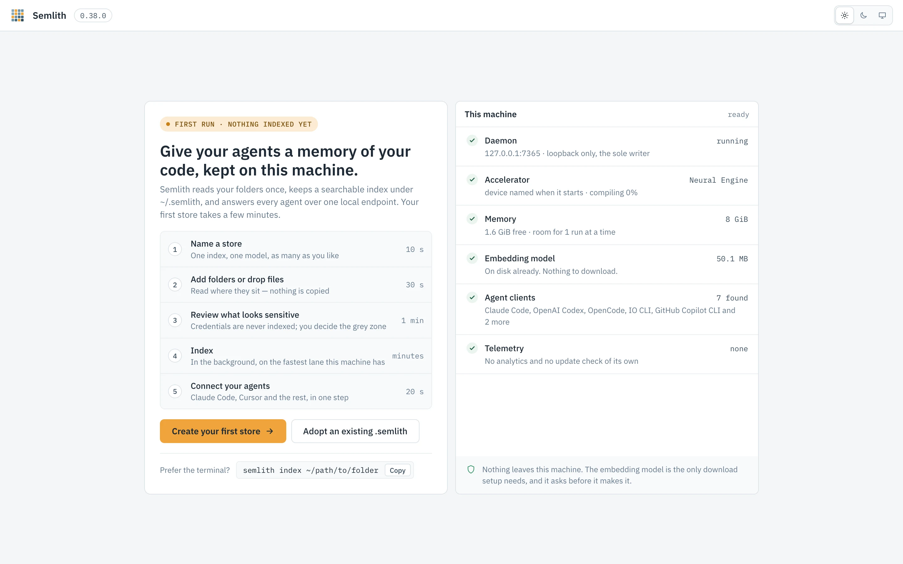

Shown in place of the shell while the daemon has no store, and again from
Settings › About (**Open the first-run screen**) or `#/welcome`. Agents, Privacy
and Settings stay reachable without a store.

The left side lists the wizard's steps and offers **Create your first store**
(the wizard, ending with Connect) and **Adopt an existing .semlith** (a folder
picker confined to your home, with folders that already hold a store marked; the
choice is registered and opened without re-embedding). Under them is a copyable
`semlith index ~/path/to/folder`.

**This machine**, on the right, is read from the daemon:

| Check | Shows |
|---|---|
| Daemon | The address, loopback only, sole writer. |
| Accelerator | The lane that will embed — Neural Engine, GPU or CPU — and its state (ready, compiling, downloading with a percentage). |
| Memory | Total and free memory, and how many runs at once that allows. |
| Embedding model | Whether it is cached; if not, that it downloads once at the first run (or, under airgap, that the cache must be pre-seeded). |
| Agent clients | The clients found on this machine. None is not a fault. |
| Telemetry | None: no analytics, no update check of its own. |

The model download is the only thing semlith fetches on its own; starting the
first run is your agreement to it.

## The store wizard

Makes a store, fills it and connects agents, asking before anything sensitive goes
in. **New store** opens it at step 1; a store's **Add sources** opens it at step 2
for that store. Steps: **Name**, **Sources**, **Review**, **Index**, and
**Connect** when started from Welcome. A side panel summarises what each step
chose.

### Name

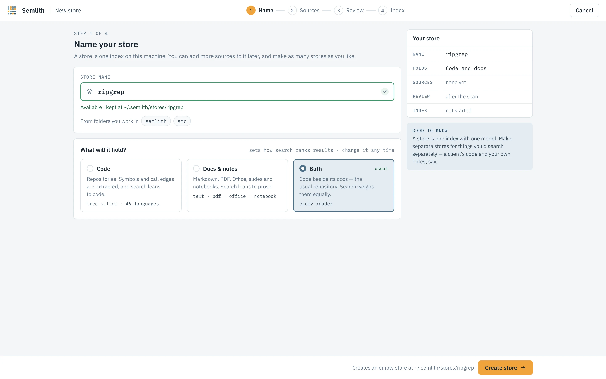

Names are lowercase letters, digits and dashes, starting with a letter or digit,
up to 40 characters; the field says as you type whether the name is free and where
the store will live (`~/.semlith/stores/<name>`). **What will it hold?** — Code,
Docs & notes, or Both — sets the store's default search lean (changeable later on
its Settings tab); it never filters. The embedding model is shown and fixed for
the store's life, because vectors from two models are not comparable.

**Create store** creates the store, empty. Leaving the wizard before anything is
indexed asks whether to **Delete store** or **Keep it**.

### Sources

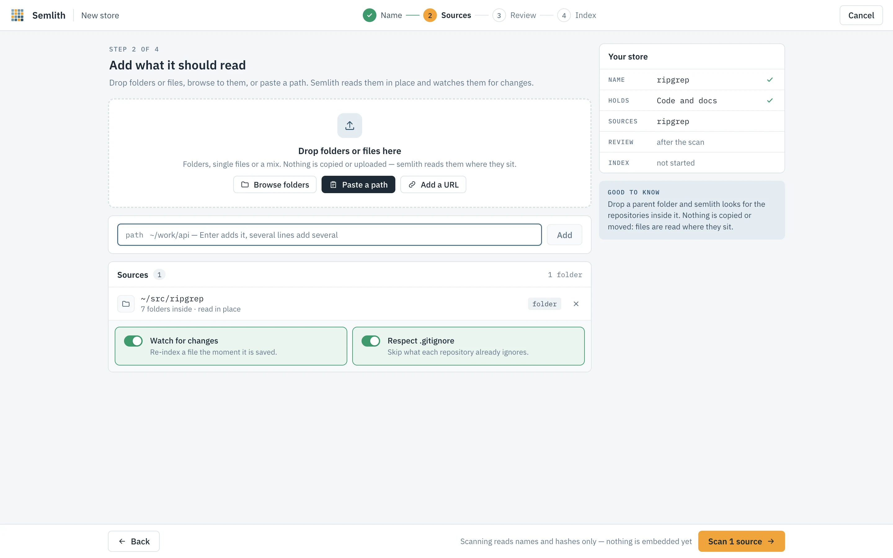

Nothing is copied or uploaded: sources are read where they sit and, with **Watch
for changes** on, re-indexed when saved.

- **Drop folders or files** on the drop zone (see [Drag and drop](#drag-and-drop)).
- **Browse folders** — a picker confined to your home, multi-select, showing which
  folders other stores already read.
- **Paste a path** — one per line; quotes are stripped, `file://` URLs decoded,
  `~` expanded.
- **Add a URL** — one https request for exactly that URL (a page, a PDF, a file
  on GitHub) when the run starts; no crawling, no credentials, kept in the
  store's own downloads folder. Refused under airgap.

A folder holding several git repositories (detected as `semlith index
--projects` does) offers **Keep together** (one store) or **One store each** (as
`--each`). **Respect .gitignore** skips what each repository ignores.

### Review

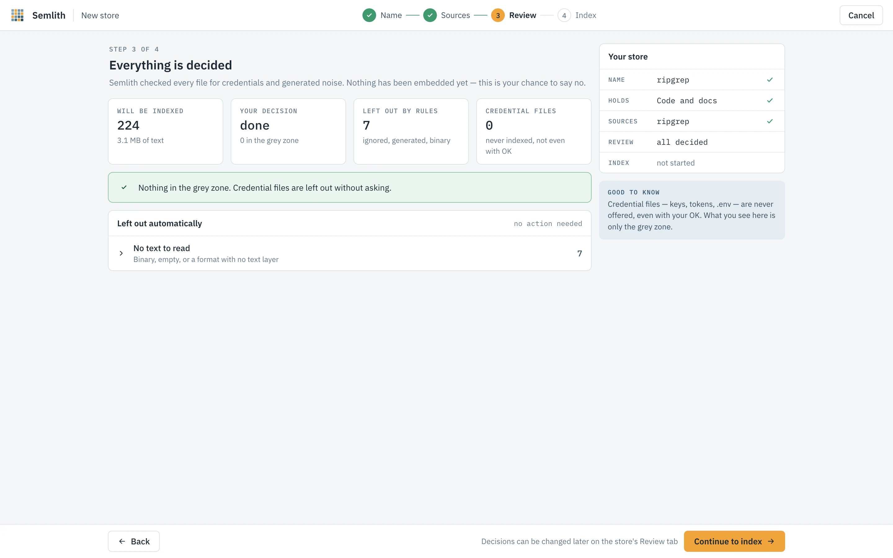

Nothing is embedded here. **Scan** walks the tree, hashes each file, checks it for
credentials and against the rules, then shows the files to index, the text they
hold, how many are unchanged (skipped by hash), and an estimated embedding time
from this machine's last measured rate.

**Needs your decision** is the grey zone: files held back that a person may let
in. Each row shows why it was held (a secret-shaped value, or a limit such as the
size cap or a generated folder), the **risk if indexed** as a percentage and band,
the likely kind of what matched, masked evidence, and a suggested action. The
decisions are **Keep out**, **Redact & index** (each detected value becomes a
typed placeholder before chunking; it covers only what the scanner detected) and
**Index**. Decide one file at a time or on a selection (filter by view and risk,
**Select all shown**); **Apply suggestions to N undecided** takes every suggestion
and **Undo** reverses the last decision. Every decision is logged per file as
yours. An agent can never make one: the route refuses any caller that is not a
person on this page.

**Left out automatically** groups what needs no decision: ignored files, build
output, lockfiles, oversize files, files with no text, and credential files.
Credential files — keys, tokens, `.env` — are never offered, even with your
agreement. Undecided files stay out; decisions can be changed later on the store's
Review tab.

### Index

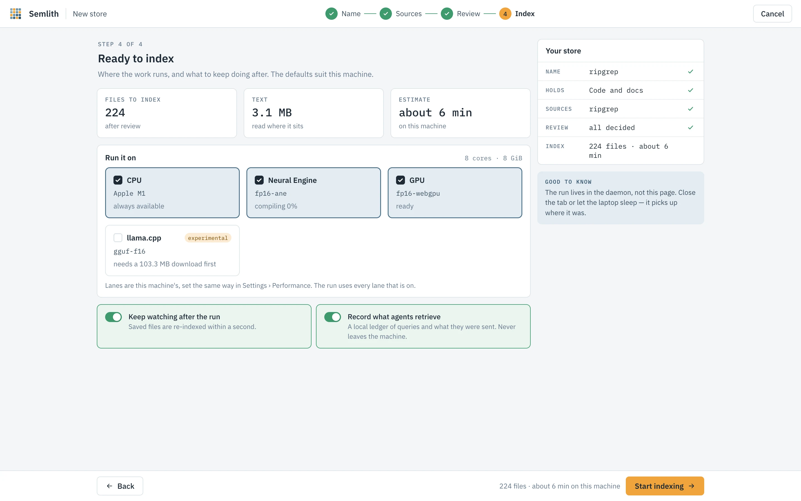

**Run it on** lists this machine's embedding lanes with their last measured rates
and a switch each — the same switches as [Settings › Performance](#performance);
a lane whose pack is missing asks before downloading it. **Keep watching after the
run** and **Record what agents retrieve** are this store's watch and ledger
settings. If the model is not on disk, the step names the source and size, and
**Start indexing** is your agreement to that download.


During the run the step shows the stages, files read, chunks, rate, time left and
the log, with **Pause**, **Resume** and **Stop…** (see [Runs](#runs)). The run
lives in the daemon: close the tab and the header's run pill still follows it.

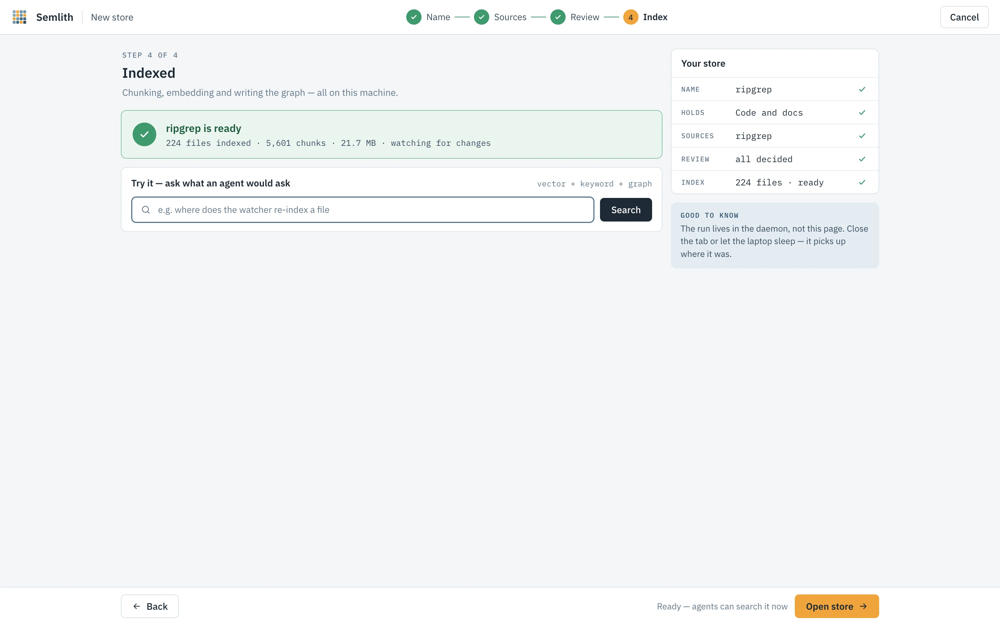

When it finishes, **Try it** runs a search the way an agent would see it.

### Connect

Shown when the wizard started from Welcome: the agent clients found here, which
file each registration writes, and that each file is backed up beside itself
first. **Register** writes the selected clients; **Set a client up by hand
instead** shows the configuration to copy. Agents › Add a client does the same
any time.

### Drag and drop

Browsers never give a page a dropped item's path, and semlith uploads nothing. The
page sends a description of each item — name, file or folder, size, modification
time, and for a folder its first-level names and up to twenty files' sizes and
times — to `POST /api/drop/resolve`, and the daemon finds it on disk, trying in
order: the macOS drag pasteboard (only if it changed for this drag and every name
and kind matches); the selection of open Explorer windows on Windows; the OS file
index (Spotlight, Windows Search, plocate, localsearch or Baloo); existing store
roots and their parents; recently browsed folders; and finally a walk capped at
two seconds.

A match is offered as **Add this path?** and added only when you confirm; several
give a picker; none puts the cursor in the path box with this system's
copy-path shortcut. A path in a temporary folder (an item dragged out of an
archive) is refused with a request to extract it first. With the file-manager
helpers installed (Settings › About), Finder, Explorer, Nautilus, Dolphin and
Thunar offer **Index with semlith** on a selection.

## Home


What is indexed, what needs you, which agents are connected and what they asked —
each one click from where it is handled.

**Getting started** is a four-item checklist — create a store, connect an agent,
run a first search, check Privacy — that ticks itself from the daemon's state and
can be dismissed.

| Figure | Counts |
|---|---|
| Stores | Stores, and what is going on: runs going, stores needing review, or all fresh and watched. |
| Files indexed | Files across every store, and their chunks. |
| Agents connected | Clients talking to the daemon now, and which agent asked last; otherwise how many are registered or found. |
| Fewer tokens | What agents read against reading those files whole, always with coverage and tier — see [Ledger](#ledger). |

**Stores** is the store table at a glance. **What agents asked** lists recent
retrievals and says when recording is paused. **Needs attention** lists what is
waiting, each with its button: files held for review, a store whose directory is
gone or database did not open, a missing source (**Re-point**), a ledger chain
that does not verify (**Inspect**), reclaimable space (**Compact**), no agent
registered or connected (**Connect**), a registered client that cannot reach
semlith, and a finished run; otherwise it says all clear. **Agents** lists the
connected clients, and **Watcher** is a live feed of changes on disk since the
daemon started. Every part reads live.

## Stores

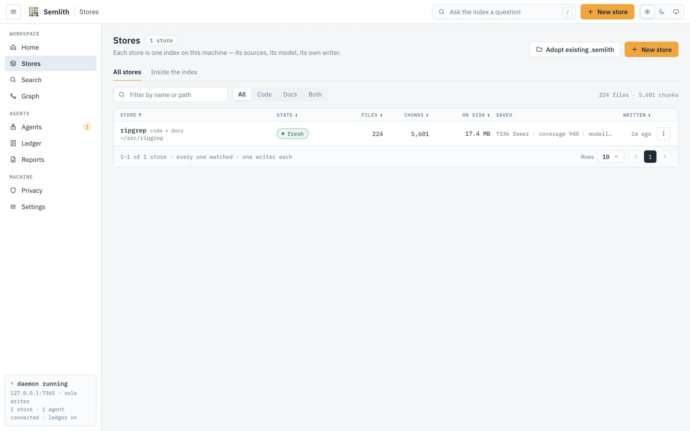

Every store on this machine, what it holds, and whether it is being kept current.
A **store** is one directory holding a vector index and a SQLite database that
must agree. New stores live in `~/.semlith/stores/<name>`; a registry beside them
records each store's **roots**, the directories it covers. One store can hold
several roots because a store is a corpus: put directories you want answered in
one ranking into one store, and corpora that should not be ranked against each
other into separate ones.

Two tabs — **All stores** and **Inside the index** — and two buttons, **Adopt
existing .semlith** (register a store made elsewhere, without re-embedding) and
**New store**.

### All stores

Filter by name or path and by kind (Code, Docs, Both).

| Column | Meaning |
|---|---|
| Store | Name, kind, and what it read. |
| State | See below. |
| Files / Chunks | Files indexed, and the pieces they were cut into. |
| On disk | Size, and how much is reclaimable. |
| Saved | Tokens agents did not read because of this store, with coverage and tier. |
| Written | When the store was last written. |

| State | Meaning |
|---|---|
| `indexing` | A run is going, with its percentage. |
| `paused` | A run is held by Pause. |
| `N to review` | Files are waiting for a person's decision. |
| `empty` | The store holds nothing. |
| `not indexed` | Sources were added and not yet embedded. |
| `fresh` | Up to date and watched. |

A store whose directory is gone or database cannot be read says so on its row
without affecting others. Every load re-reads the registry, so a store created by
`semlith index` in another terminal appears here — and answers over MCP —
without a restart.

Row menu: **Open**, **Add sources**, **Search it**, **Re-index** (skips unchanged
files by hash), **Compact** (rewrites vectors without deleted chunks and vacuums
the database; search keeps working; the daemon also compacts idle stores past the
threshold in Settings) and **Forget…** (deletes the index, vectors and ledger
rows, never your files; asks first). **Compact N** compacts every store with
something to reclaim.

### Inside the index

Measured from the stores on every read: lines of code (comments and blanks
separated), words indexed across code, prose, slides, sheets and notebooks, printed
pages at 500 words a page, reading time at 250 words a minute, and the language mix
with how many languages carry graph edges.

- **What is in the prose** — PDF pages, slides (`.pptx`, `.odp`), non-empty sheet
  cells (`.xlsx`, `.ods`, `.csv`, `.tsv`) and notebook cells, each beside its file
  count. Counted by each reader in the pass that extracts the text; formats with no
  such unit are counted in files.
- **Shape of the code** — average line, comment and blank lines, deepest path,
  longest file.
- **Time in the corpus** — first read, newest write, median retrieval time, runs
  remembered.
- **What the graph holds** — symbols, settled edges, unresolved calls, names
  defined more than once.
- **Chunks added per month**, by when semlith read them.
- **Graph health** — call edges split into extracted, resolved, ambiguous and
  unresolved (see [Confidence](#confidence)), and the most-defined names, which are
  the ones whose edges become ambiguous.

Each store is measured on its own connection, so measuring a very large store does
not hold up the store list or a search. The page reads live and keeps its scroll
position.

## A store's page

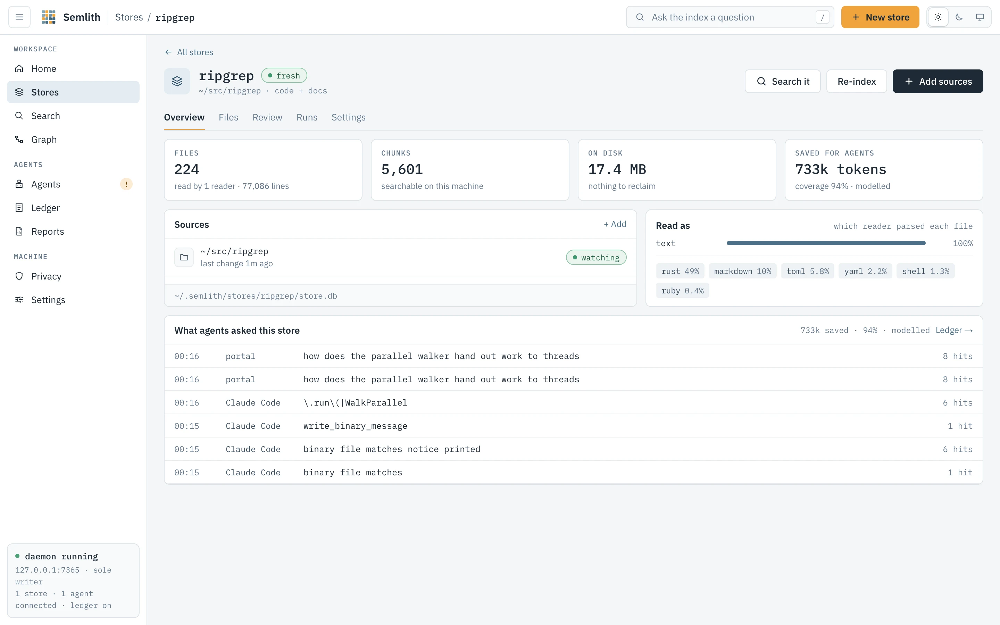

Everything about one store in five tabs — **Overview**, **Files**, **Review**,
**Runs**, **Settings** — with **Search it**, **Re-index** and **Add sources** in
the header. A name that is no longer a store says so.

### Overview

Files and the readers that read them, chunks, size on disk and what is
reclaimable, and tokens saved for agents with coverage and tier. **Sources** lists
each root with whether it is watched and its last change, and flags a missing one.
**Read as** counts files per reader — PDF, notebooks, HTML, Word, PowerPoint,
Excel, OpenDocument, EPUB, RTF, mail and images besides plain text, chosen by
extension before the bytes are read — and the language mix. **What agents asked
this store** lists its recent retrievals. An empty store shows how to fill it
instead.

### Files

Exactly what is in the store, so "not indexed" and "indexed but does not say that"
stop looking the same. Path glob (`src/**`), type and language filters narrow the
server's query, so the count is the filter's. **List** shows path, reader,
language, lines, chunks and when indexed. **Tree** is an explorer, one root per
top-level entry, each folder loaded only when opened; files on disk but not in the
store appear greyed with the reason (binary, refused as a secret, credential file,
over the size cap, generated folder, `.gitignore`, `.semlithignore`, not indexed
yet). A folder past 1 000 entries lists the first thousand and counts the rest.
This is what `semlith files --tree` and `semlith_files {tree: true}` return.

Selected rows can be copied as paths, re-indexed or **Forgotten** (chunks, vectors
and edges dropped; the file is untouched and comes back when it next changes, if
watched).

### Review

**Waiting for your decision** is this store's grey zone, decided exactly as in
the [wizard's Review step](#review) — singly or on a selection, logged per file as
yours, never by an agent. **Decisions** is the record of every decision in this
store, yours and the rules': its outcome (accepted, redacted and indexed, kept out,
read as an image, never indexed) and who made it, filterable by path or reason,
outcome, and **Yours** or **Rules**. Undoing one of yours takes the file out and
holds it again with today's reasons.

### Runs

**Running now** is the current run with **Pause**, **Resume** and **Stop…**, or
**Take out of the queue** if it has not started. **History** lists every finished
run across restarts: its kind (first index, re-index, watcher catch-up, compact),
when, how long, what it indexed, and its stage timings and log.

A run lives in the daemon — id, paths, status, counters, clock, the last 500 log
lines and its summary — so navigating away or closing the tab changes nothing.
Only its own **Stop** or the daemon ending cuts it short.

| Status | Meaning |
|---|---|
| `review` | Scanned and held for **Start indexing**; holds no slot and no writer. |
| `queued` | Waiting: with a place in line, for the daemon-wide queue; without one, for its store's writer. |
| `running` | A writer has it. |
| `pausing` / `paused` | Pause pressed; held at the next batch boundary. |
| `held` | Admitted, then held because *runs at once* was lowered. Held runs resume first, keeping progress. |
| `stopping` | Undoing what the run embedded; on a large corpus this takes as long as the embedding did. |
| `done` / `stopped` / `failed` | Finished; stopped and undone; ended on an error that was not a single file's. |

**Figures.** Files read, chunks, rate and time left. The rate is chunks over the
last ten seconds of active time (pauses excluded), also shown per lane —
`Neural Engine 141/s · cache 722/s`, where `cache` is the vector cache returning
vectors it already holds. The time left is the daemon's estimate of the embedding
work left over a smoothed rate; until a minute of embedding has been measured it
leans on this machine's known lane speeds. Between polls the page counts down,
correcting to the daemon's figure on each one.

**Stages** say where the time went, as `semlith index --verbose` prints them —
`walk 0.0 s, read+hash 0.2 s, parse+chunk 0.6 s, tokenize 2.5 s, embed wait (ane)
125.3 s, write 11.8 s` — and sum to the wall time. While the last embeddings
drain, the line counts the chunks still embedding live.

**Log.** One line per file — `indexed`, `unchanged`, `skipped`, `removed`,
`refused`, `failed` — with the reason for the last three. A refusal names the rule
or the credential kind and line, never the matched text. The page reads the log by
cursor, so two tabs each see every line once.

**Pause** holds the run at its next batch, keeping its writer; **Resume** carries
on from the same chunk. **Stop** rolls back everything the run embedded and says
so first; its checkbox also deletes the store (ticked by default only if the store
was empty before the run). **Take out of the queue** removes a run that has
embedded nothing.

Watcher catch-ups (picking up what changed while nothing watched) and bursts of
more than 32 file events are runs too, queued like any other; a smaller burst is
indexed at once, so a saved file reaches search within seconds. The tab reads live
and paints in place, keeping the log's scroll position.

### Settings

- **Name** — rename; agents see the new name on their next call.
- **Search leans to** — Code, Docs or Neither: the default `prefer` for this store;
  it multiplies, never filters.
- **Watch for changes** — re-index a file the moment it is saved.
- **Record retrievals** — whether this store's queries enter the ledger (says so
  when recording is paused machine-wide).
- **Respect .gitignore** — on every run and on the watcher.
- **Maintenance** — **Compact now** (with the reclaimable size) and **Re-index
  everything**.
- **Where it reads from** — each root; a moved root offers **Re-point…**, which
  changes only the registry entry. A store outside the store home that is not yet
  trusted offers **Trust**, after which plain `semlith` commands find it.
- **Forget this store** — deletes the index and its ledger rows, never your files;
  asks first.

## Search


Ask the corpus a question and read the answer the way an agent receives it. The box
takes the question; under it are the scope (all stores or one), **+ language** and
**+ path** filters, and four modes:

| Mode | Returns the same as |
|---|---|
| **Ranked** | `semlith_search` — spans ranked by meaning and words. |
| **Brief** | `semlith_brief`. |
| **Exact** | `semlith_search {exact: true}` — every matching line, like `grep -E`. |
| **Pattern** | `semlith_pattern` — a tree-sitter query over one language. |

Before a search the page offers four example questions and your recent searches.

### How ranking works

Every ranked query searches two lists over the same corpus. The **vector** search
embeds the question and finds chunks close in meaning, which is how plain words find
a paragraph that never uses them. The **keyword** search runs the terms through a
full-text index, which is how an identifier finds the line it is on. A store with
images adds a third list, matching your words against pictures through CLIP.

Each list is searched deeper than asked, then the lists are **fused** by reciprocal
rank: a chunk both lists rank well beats one only a single list liked. The code
graph is not part of ranking; related-but-not-matching code is what Graph's
neighbours and blast radius are for. Scores order one result set and mean nothing
across two. The line above the results — e.g. `identifier-shaped · keyword weighted
×2` — comes from the answer itself: an identifier-shaped query weights the keyword
list twice; a question weights them equally. An identifier query the ranking
answers with nothing falls through to **Exact**.

| Badge | Meaning |
|---|---|
| `definition` | This chunk defines the name you typed; it is lifted above the ranking (identifier queries only). |
| `vector` | The meaning matched. |
| `keyword` | The words are literally in the text. |
| `image` | The picture matched the words. |

**Freshness.** Every hit is `fresh` if its file still has the size and
modification time it had when indexed, `stale` otherwise — one `stat` per path,
conservative on purpose (a bare `touch` reads stale). A stale hit says to re-read
the file before quoting it; the lines shown are what semlith read.

**Locators.** Each hit is one line: span, enclosing symbol and kind, the lists that
found it, freshness, and the line holding most of your words, grouped by file in
ranking order. That is the first stage and what an agent gets by default; the
span itself is read only for the hit opened, so eight wrong hits cost eight lines,
not eight chunks. The footer gives hits shown, their tokens and the share of the
budget. A store still embedding says so: keyword covers it meanwhile, vector does
not yet.

### Dials

| Dial | Effect |
|---|---|
| Scope | All stores, or one. |
| **Lean to** | `code`, `docs` or `either`; multiplies, never filters. A store searched alone defaults to its own lean. |
| **Results** | `k`, 1 to 50; 8 by default. |
| **Budget** | Tokens one answer may cost: 500, 1000, 1500 (default), 3000 or 6000. |
| `language`, `path` | Only this language; only paths matching this glob. |

**Exact** runs the query as a regular expression (or literal text if it is not a
valid one) over the stored text of every indexed file in scope, prose included,
listing each file once with its matching lines and the definition each sits in;
past the limit it says more lines match. **Pattern** needs a language and captures
every node the query matches, e.g. `(call_expression function: (identifier) @f)`.

### Detail panel

Opening a hit shows its span with line numbers from the span's own first line —
the numbers `semlith read` prints. **Read whole symbol** widens to the enclosing
definition (**Show the span only** narrows back); **Copy path:lines** copies the
locator; **Open in graph →** selects the symbol in Graph; **One hop around** lists
its callers and callees with confidence badges — what a brief would add. An image
hit shows the picture, fetched through the API and handed over as a `data:` URL
(the policy allows `img-src 'self' data:`).

**Brief** shows exactly what `semlith_brief` returns: the best span in full, one
line per other hit within the budget, and the graph edges it carries. **Copy as the
agent sees it** copies it as text. When the budget leaves no room for a span's text,
the locator is still sent and the page says so.

## Graph


What the code says about itself: which definitions exist and which reach which.
One store at a time — chosen in the toolbar — because a store's graph is
self-contained and drawing every store at once could stall the daemon. Three tabs:
**Explore**, **Blast radius**, **Path & evidence**.

### Nodes and edges

A **node** is a definition tree-sitter found; its **kind** (`function`, `class`,
`struct`, `method`, `interface`…) is whatever that grammar's tags query calls it.
Every file also gets a synthetic **module node** spanning the whole file, so
top-level definitions and references have somewhere to belong. Markdown
headings, YAML/TOML/JSON keys, CSS selectors and HTML elements are symbols you can
find and that locators name, but never the target of an edge.

| Edge | What the source said |
|---|---|
| `defines` | This file defines this name (module node → each top-level definition). |
| `contains` | This definition is inside that one, e.g. a method in its class. |
| `calls` | This code calls that name. |
| `imports` | This file imports that name or module. |
| `references` | This code mentions that name without calling it. |
| `aliases` | This name stands for that one: a re-export or renamed import. |

`defines` and `contains` are structural; the other four are dependencies, and only
those are walked by a path or blast radius. An edge records the line it was written
on; when that line is unknown nothing is printed rather than a wrong one.

### Confidence

| Value | Claim |
|---|---|
| `extracted` | The file said where the target came from: a structural edge, or a call whose name or module the file also imports. |
| `resolved` | Several definitions matched the name and ranking left exactly one. |
| `inferred` | Matched by bare name alone. |
| `ambiguous` | Several definitions carry the name and nothing chose; the edge carries the count. |

Treat `extracted` and `resolved` as answers, `inferred` as a hint and `ambiguous`
as a question. `extracted` and `inferred` are stored at extraction; `resolved` and
`ambiguous` are computed on every read, because indexing another definition of the
same name can change the answer. Resolution prefers a definition in the same file,
then the file the source names, then a file the source imports, then a unique
definition in the corpus. Ambiguous edges are drawn dashed amber and never crossed
by a walk that prefers verified edges; a chain may also only leave from the
definition it arrived at (see **seam** below).

### Explore

**Jump to a symbol** centres the canvas on a name. The **calls**, **imports**,
**inferred** and **ambiguous** chips filter what is drawn, instantly; other edge
kinds are always drawn, muted. **Fit** frames the drawing. The force layout is
solved before the first frame; drag a node to move it, click to select, hover to
lift its edges. A view holds at most 63 symbols, captioned `N of M symbols · N
edges`. The default symbol is a name defined once in the store with the most
resolved edges — not the busiest name, which is usually a generic one like `new`.

**The selected-node panel** gives name, file, line range, kind and store, with
**Called by** and **Calls** lists (confidence badge and edge kind on each row,
clickable). An ambiguous row reads `name · N definitions` and expands to every
candidate. **Show unresolved** lists calls no open store defines (standard library,
unindexed dependencies). **Blast radius** and **Path from here** carry the symbol to
the other tabs. **Subsystems** groups symbols into communities over settled calls
and imports, naming each one's hubs.

### Blast radius

Everything that reaches a symbol — what would notice if you changed it — the same
function as `semlith impact` and `semlith_impact`. Controls: the exact name;
**Hops** 1–6 (default 3); **Verified edges only** (on; never crosses a name with
several definitions); **Reach**.

The answer opens with a sentence — `N definitions in N files reach <name> within N
hops` — and three figures: **Reached**, **Files**, and **Inferred** (rows reached
across an `inferred` or `ambiguous` edge: the unsettled part, stated beside the
settled). The table lists each definition, where it is, its hop and the edge that
reached it, filterable by name or file, hop and edge, and says how many more the
cap cut. A small reverse graph draws the answer; **Files to look at** groups it by
file, nearest first, with **Copy list**.

### Path & evidence

Is there a chain from one symbol to another, and what is it made of? Controls:
**From**, **to**, **Swap**, **Prefer verified** (extracted and resolved chains
first), **Strict** (refuse names with several definitions; wins over asking for
everything) and **Find the path**.

The answer is one sentence: connected in N hops by settled edges, or not, with how
the nearest chain got there. If any hop was matched by bare name or crosses a seam,
a banner says *A hypothesis, not a finding.* and **Show the inferred chain** walks
again without the refusal. The chain is one row per hop (`name @ path:line`, edge
kind, badge); a **seam** row marks where a hop arrives at one definition and the
next leaves from another. A count line follows: `N hops · N extracted · N resolved
· N inferred · N ambiguous`. **Supporting lines** quotes, per hop, the source line
the edge was written on, read from the store.

**Copy as evidence** copies exactly what `semlith trace --evidence` prints: `<from>
→ <to>`; `answer: <sentence>`; one numbered line per hop, `N. <from> @
<path>:<line> -> <to> @ <path>:<line>  [<support class>]`, seams appended to the
hop they follow; then `supporting lines`, one per hop marked `[supporting fact]` or
`[candidate]`. No scores, no prose, nothing the store does not hold.

## Agents

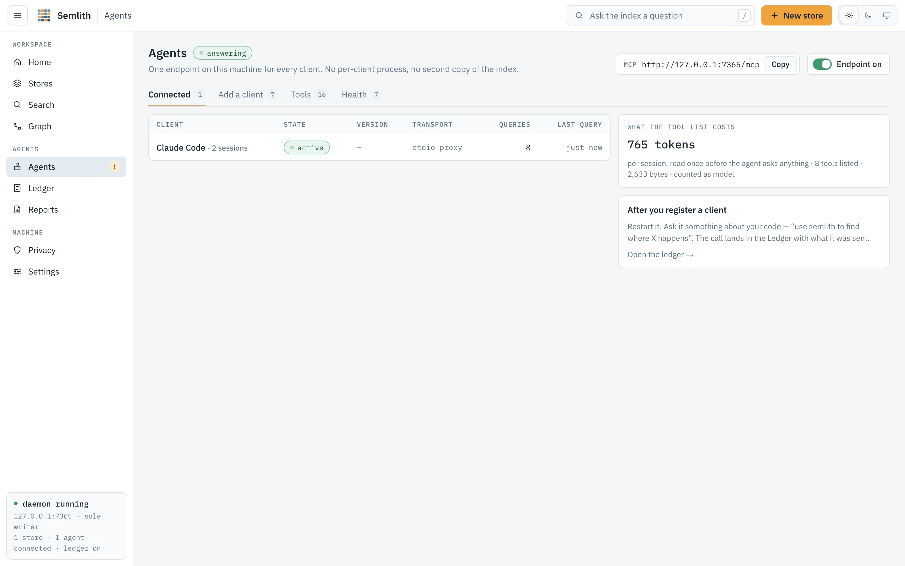

Connect agents to this daemon and see which are connected. **The endpoint** sits
at the top: its URL with **Copy**, and a switch. Off drops only the `/mcp` route —
stores, watcher and portal keep working — and a client gets a clear refusal, key or
not.

### Connected

Clients talking to the daemon now: the name from the MCP handshake (or, for the
stdio proxy, the app that launched it), state, version, transport, queries and the
last one. Several windows of one client are one row with their sessions counted.
**What the tool list costs** shows the tool list's size in tokens and bytes — paid
once per session before the agent asks anything — measured from what the daemon
serves now. With nothing connected, the tab says how to get a first client: register
it, then restart it.

### Add a client

The documented clients, grouped Terminal, Editors and Desktop, each marked found or
not and registered or not. **Register** / **Unregister** run the client's own
command where it has one, otherwise edit its configuration file after backing it up
beside itself; **Register N** registers every found client. For a client semlith
cannot write to, the **Config file** and **Terminal** forms are shown to copy. The
HTTP form names `${SEMLITH_AGENT_KEY}` rather than the key; the `semlith mcp` form
reads the key file itself. Every stanza is parsed from `docs/clients.md`, the same
text `tests/clients.rs` runs.

### Tools

Every tool the endpoint serves, the question each answers (from its own
definition), and its typical answer size in tokens — the median of this machine's
answers once there are five, an estimate until then.

### Health

What `semlith doctor` prints, from the same function: per client, whether semlith is
registered and at what scope, the state of its skill, steering hook (and mode) and
rule file, and what to run to fix it. *Not installed* (not a fault), *found, not
registered*, and *switched off in N folders* (a directory override, named by its
directories) are kept apart. **Check again** re-reads. Under the table are the
machine checks from the [privacy rules](#rules-the-binary-enforces) that carry a
reading. Registration state is read from each client's configuration files; no
client program is run. The page reads live.

## Ledger


What your agents actually retrieved, recorded locally, so any saving semlith claims
has a denominator. Every surface records through one module — stdio MCP, the
daemon's `/mcp`, the CLI and the portal — into a `retrievals` table in each store's
own database. Nothing leaves the machine.

**Recording** is a switch. Off pauses writing at runtime; on again continues the
hash chain from the row before the pause. `semlith start --no-ledger` and
`SEMLITH_LEDGER=0` turn it off for a session or a machine, and the switch says so. A
store's own switch is on its Settings tab.

**Rows are hash-chained**, so an edited or deleted row is detectable. If the chain
does not verify, a banner offers **Re-verify**; a repair appends one note row saying
where it broke and verifies from there — no row is edited or removed.
`semlith ledger --verify` is the same walk.

| Figure | Counts |
|---|---|
| Queries recorded | Retrievals, and how many clients ran them. |
| Fewer tokens | Whole-file tokens over excerpt tokens, with coverage and tier. |
| Net tokens not read | Whole-file less excerpt, over rows with a hit. |
| Zero-hit | Share and count of queries the corpus could not answer. |

- **Coverage** — the share of retrievals the saving is computed over; a retrieval
  that found nothing counts in the denominator.
- **Tier** — `measured` when every credited row was counted by the store's
  tokenizer, `modelled` when any was estimated at four characters per token.
- **Refunds** — files an agent read whole anyway: measured on clients with the
  steering hook, a floor elsewhere. A refund is an agent not reaching for semlith; a
  zero hit is semlith not reaching the answer.

The ratio never counts a failure as a success or a row twice; the whole-file side
is the files' size on disk at four characters per token.

**What agents read, against reading whole files** draws the two totals; **By
client** draws a bar per client that filters the tables below. Three tabs:
**Sessions** (one row per conversation: client, model, reads, net tokens, and
**Saved** at that model's input price), **Retrievals** (one row per query: when,
query, hits, what was sent, tier; filter by store, client, tier, **Zero-hit only**)
and **Session replay** (what an agent did after each answer — sufficed, missed, or
followed by a whole-file read — read from local agent session logs). Tables sort,
page, and export to Markdown, CSV and JSON.

**Usage from client logs**, off by default, adds each call's model and cost from
that client's own session log, matched by tool, time and arguments; a client whose
log cannot be read says `not recorded`. Cost is the client's own figure where it
records one, otherwise tokens at the built-in models.dev price snapshot (updatable
from Reports or Settings › About). `semlith ledger --usage on|off` is the same
switch. Session replay is on by default (switch on Privacy) and reads local logs
only. The page reads live.

## Reports

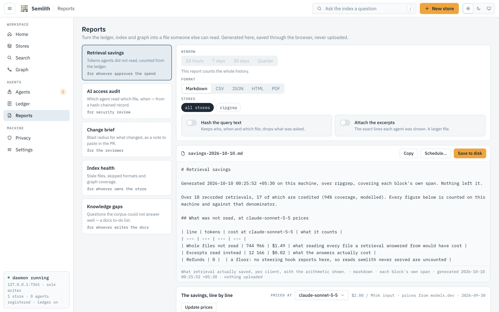

Turns the ledger, index and graph into a file for someone who will never open the
portal. Generated here, saved through the browser, never uploaded; the same
generator answers `semlith report` and `semlith_report`, byte for byte.

| Report | What it is | For |
|---|---|---|
| Retrieval savings | Tokens agents did not read, from the ledger. | whoever approves the spend |
| AI access audit | Which agent read which file, when, from the hash-chained record. | security review and AI-use policy |
| Change brief | Blast radius of what changed, as a note for the PR. | the reviewer |
| Index health | Stale files, skipped formats, graph coverage. | whoever owns the store |
| Knowledge gaps | Questions the corpus could not answer well. | whoever writes the docs |

Choosing a report generates it. **Window** (24 hours, 7 days, 30 days, Quarter)
applies to the access audit and change brief; the others count the whole history
and say so. **Format** is Markdown, CSV, JSON, HTML or PDF, rendered by the server
(the PDF is typeset inside the binary, not printed from HTML). **Stores** is all or
a selection. **Hash the query text** replaces each query with a digest; **Attach
the excerpts** adds the exact lines each agent was shown.

The preview shows the file name (dated by this machine's clock), **Copy** and
**Save to disk** (the browser's own save; no route writes a file for the page).
**The savings, line by line** prices the arithmetic at a model you pick, with the
rate, source and date; **Update prices** fetches models.dev's table once, after
asking — the only network request on this page. **Without the browser** shows the
equivalent `semlith report` command and MCP call. The page never redraws on its own:
a report is a reading of a moment.

### Schedules

A schedule is a report the daemon writes on a cadence into a directory you name.
**Schedule…** on the preview asks for both; the card lists each schedule with its
last and next run and **Remove schedule**. Schedules live in
`~/.semlith/schedules.json`; with no daemon running they wait. The daemon never
creates the directory (an unmounted volume must not be written into its mount
point), replaces the file in place each run (a tracked folder shows a readable
diff), never generates two at once, and waits while a store is indexing.

```sh
semlith schedule list
semlith schedule add savings --every 604800 --to ~/Reports --format pdf
semlith schedule remove s1
semlith schedule set s1 off
```

## Privacy

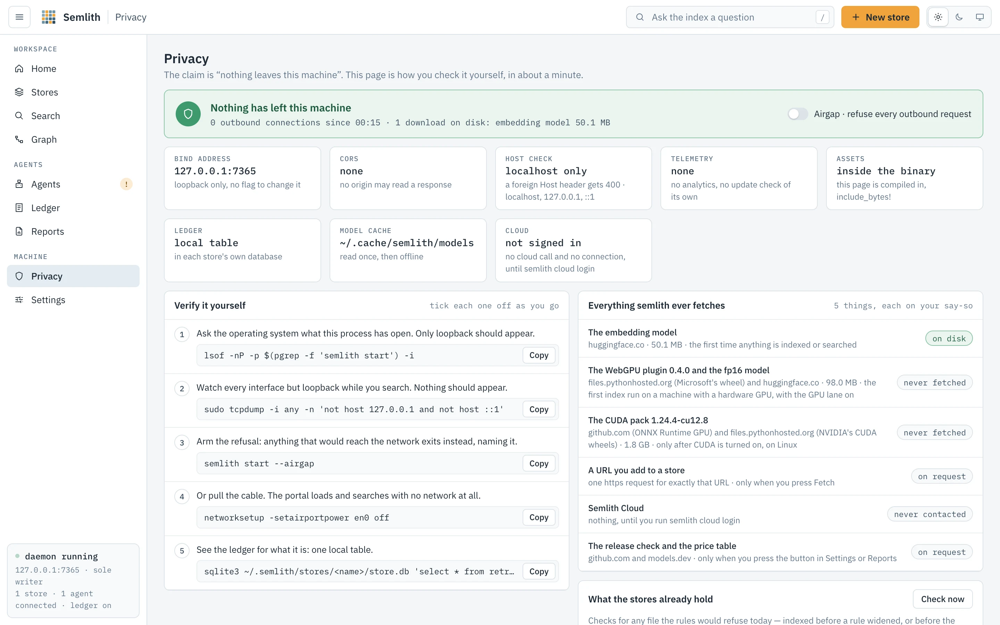

Check the claim that nothing leaves this machine instead of believing it.

**The verdict** counts outbound connections since the daemon started, from a
counter on every outbound request. **Airgap**, beside it, makes any outbound
request exit and name what it would have fetched; when the daemon was started with
`--airgap` or `SEMLITH_AIRGAP` the switch says so and stays on.

**The facts** — bind address (loopback only), CORS (none), host check (foreign
`Host` gets 400), telemetry (none), assets (compiled into the binary), the ledger
(a local table per store), the model cache, and Cloud (not contacted until `semlith
cloud login`).

**Verify it yourself** — five copyable steps you tick off: list what the process
has open (`lsof`; only loopback should appear); watch every other interface while
you search (`tcpdump`; nothing should appear); arm the refusal with `semlith start
--airgap`; pull the cable and search anyway; read the ledger table with `sqlite3`.

**Everything semlith ever fetches** — each download with its source, size, trigger
and whether it is cached: the embedding model (once, on the first run), the WebGPU
plugin and fp16 model, the CUDA pack (only after its lane is turned on), a URL you
add (one request, when you press Fetch), Semlith Cloud (nothing until you sign in),
and the release check and price table (github.com and models.dev, only when you
press the button). Airgap refuses all of them unless already cached.

**What the stores already hold** runs today's refusal rules backwards: **Check
now** applies the deny-list to each file's name and the credential shapes to its
stored text, across every open store, to find files taken in before a rule widened
— the same `Semlith::scan` as `semlith scan`. Rows show store, path and reason,
never the matched text; **Forget** drops a file's chunks. There is no MCP tool for
this: an agent does not decide what a store may hold.

**Session replay** switches the Ledger's replay tab, which reads local agent session
logs and keeps nothing else.

### Rules the binary enforces

Each row is a rule and what this daemon found when it checked — a path, a file
mode, a count. A failing row carries the command that repairs it and, where safe, a
**Repair** button. Safe means the repair narrows access, is idempotent, touches
only a path semlith owns, and is confirmed by re-running the check; it reports what
changed and what it was (`0700, was 0755`). It calls the same engine as `semlith
doctor --fix`. The rules include: a person may decide on refused files in bulk and
an agent never may; ledger recording can be paused at runtime; session replay is on
by default. The page reads live, so a `chmod` in a terminal turns a row without a
reload.

## Settings

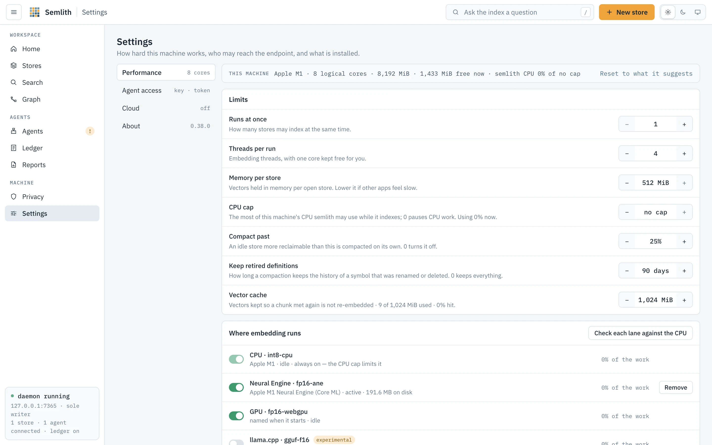

How hard this machine works, who may reach the endpoint, and what is installed, in
four sections.

### Performance

**This machine** shows logical cores, total and free memory, and semlith's own CPU
use, read on every request; **Reset to what it suggests** restores every limit.

| Limit | What it is |
|---|---|
| Runs at once | Stores that may index at the same time: free memory less a 2 GiB reserve over one run's peak, capped by the cores with one kept free. |
| Threads per run | Embedding threads, with one core kept free. |
| Memory per store | Vectors held in memory per open store. |
| CPU cap | The most CPU semlith's process may use while indexing, 0–100 % of all cores, in steps of 5; 100 is no cap, 0 pauses CPU work (the run card says so). A value off the grid snaps onto it. |
| Compact past | Reclaimable share above which an idle store compacts itself; 0 turns it off. |
| Keep retired definitions | How long compaction keeps the history of renamed or deleted symbols; 0 keeps all. |
| Vector cache | Vectors kept so a chunk met again is not re-embedded, with use and hit rate; 0 turns it off. |

The route enforces the same ceilings as the page (the core count for parallelism,
free memory less the reserve for memory). Saved values apply at once to running
work and live in `~/.semlith/settings.json`. A value set by `SEMLITH_INDEX_PARALLEL`,
`SEMLITH_EMBED_THREADS`, `SEMLITH_INDEX_MEMORY`, `SEMLITH_VECTOR_CACHE_MB` or
`SEMLITH_CPU_CAP` is shown and locked.

**Where embedding runs** has a switch per lane — CPU, Neural Engine, GPU, CUDA,
TensorRT for RTX, OpenVINO, llama.cpp — with its device, variant, state (`active`,
`idle`, `starting`, `compiling` or `downloading` with progress, `unavailable` or
`failed` with the reason) and live share of the work. The last four are
experimental: built and checked without their hardware. A lane whose pack is
missing asks before downloading, naming the size. It is the same control as
`semlith accel`.

The CPU lane is always on (its switch is locked; the CPU cap holds it back). A lane
set by `SEMLITH_ACCEL` says so and is locked. Which lanes can run is read from the
hardware: no usable GPU (Metal, or a vendor Vulkan driver) disables the GPU and
llama.cpp lanes; no NVIDIA card and driver disables CUDA and TensorRT; a non-Intel
CPU disables OpenVINO. An unavailable or failed lane can be switched off, never on,
and the refusal says why. On a Mac the GPU does not embed beside the Neural Engine
unless `gpu-beside-ane` is on.

**Check each lane against the CPU** is `semlith doctor --gpu`: each lane embeds 32
fixed chunks, compared with CPU vectors committed to the repository, showing the
lowest cosine and the rate.

### Agent access

- **Agent key** — the credential HTTP clients carry; masked until **Reveal**.
  **Rotate** mints a new one; the old one keeps working for a grace window. Clients
  that launch `semlith mcp` read the key file and need no change.
- **Session token** — the portal's, shown truncated, with **Rotate**; this tab moves
  to the new token, other tabs must reopen the printed URL.
- **Start at login** — installs or removes the login service (launchd user agent,
  systemd user unit, Windows logon task), showing its mechanism, definition file and
  last start. Removing asks first: after a reboot agents cannot reach semlith until
  someone runs `semlith start`.

See [The two credentials](#the-two-credentials).

### Cloud

**Not signed in:** what Semlith Cloud adds and the two commands to copy, `semlith
cloud login <org>` and `semlith cloud connect <org>`. In this state nothing in the
daemon contacts any host; it only checks for `~/.semlith/cloud.json`.

**Signed in:** per org, its name, plan, the token's 13-character prefix (never the
token) and **Disconnect** (removes its remote stores and forgets its token here); a
reachability pill (`connected`, `unreachable`, `refused`) with the reason, read from
`/api/cloud/status` when opened and on **Check again** — the one request this page
makes to the host; and a card per remote store with its state, files, chunks, each
source's revision and lag, and a folder field with **Push** (`semlith cloud push`).
An org with no store connected offers **Connect its stores**.

**Ledger sync** has a switch per local store (`semlith cloud sync <store>
on|off`), off by default, with the last send. **What leaves this machine** lists
each kind of request and what it carries. **Reports and replay** fetches a cloud
report (`semlith cloud report`) or sends one transcript you pick (`semlith cloud
replay`), after a confirmation. Remote stores also appear on Stores and in Search's
store picker with a `remote · <org>` badge, and their hits merge into search results
by score.

### About

The running binary's version and store format, path, size and target, bind address,
store home, source licence, uptime, process id and the MCP revisions it speaks.

- **Updates** — semlith never checks on its own. **Check for updates** asks
  github.com once; **Install <version>** downloads and replaces the binary after
  asking (the running daemon keeps the old one until restarted). It is `semlith
  upgrade`.
- **Prices** — the price table behind every cost and savings figure; **Update
  prices** is `semlith prices update`.
- **First-run screen** — opens Welcome again; nothing is deleted.

**Languages** lists every name `--lang` accepts, marked where the graph is
extracted too; search and graph read the same table. The list of embedding models is
deliberately not shown — `semlith models` and `GET /api/models` give it — the one
capability with no portal view, recorded in `tests/portal.rs` and
`docs/compatibility.md`.

## Concepts

### Store, root, file, chunk

A **store** is a corpus: one vector index and one SQLite database that must agree. A
**root** is a directory a store covers; a store can have several. A **file** is one
file semlith read. A **chunk** is a piece of it — the unit embedded, searched and
returned. Chunks overlap slightly, so a span is stitched together by line number.

### Symbol and edge

A **symbol** is a definition tree-sitter found, plus one module node per file. An
**edge** is something one piece of source said about another, of six kinds. An edge
belongs to its source file and is replaced with it; its target is a *name*, resolved
at query time. That is what makes the graph safe to re-index: symbol ids change on
every re-extraction, so an id-valued target would orphan edges from other files.
Resolving by name keeps every edge as current as both ends, and still records edges
to code that was never indexed. There is no `semlith graph build`: extraction runs in
the same pass that re-embeds a changed file.

### Locator

An answer that says *where*, not *what*: path, line span, enclosing symbol and kind,
the lists that found it, freshness and one line of text. The first stage of locate,
then read — what keeps an answer cheap.

### Freshness

A hit is `fresh` when its file still has the size and modification time it had when
indexed, `stale` otherwise. A stale span is still served, marked as what semlith read
before the file changed.

### The two credentials

Each has a different reach, and neither can do the other's job.

**The session token** belongs to the portal. It is generated at daemon start, held
in memory for that run, and opens the page and every `/api/*` route. It reaches the
browser once, in the printed URL, then travels in a `Semlith-Token` header. It is
shown truncated everywhere; only the response that rotates it carries it whole.
Rotating takes effect at once: the rotating page gets the new value and every other
holder of the old one stops. No client configuration carries it.

**The agent key** belongs to agents: `sml_` followed by 64 hex characters from the
OS random source, stored in `agent.key` under the store home, created on first read
and never reminted implicitly. It opens `/mcp` and nothing else (a test asserts no
other route accepts it). It is persisted because client configuration is written
once and must survive restarts, upgrades and token rotations. The page receives it
only in the response to **Reveal**.

**Rotating the key** does not cut off an agent mid-session: the new key works at
once and the old one is still accepted for fifteen minutes or until the daemon
exits, whichever comes first. Configuration files on this machine that held the old
key are rewritten and named; anything configured elsewhere needs the new stanza
before the window closes.
